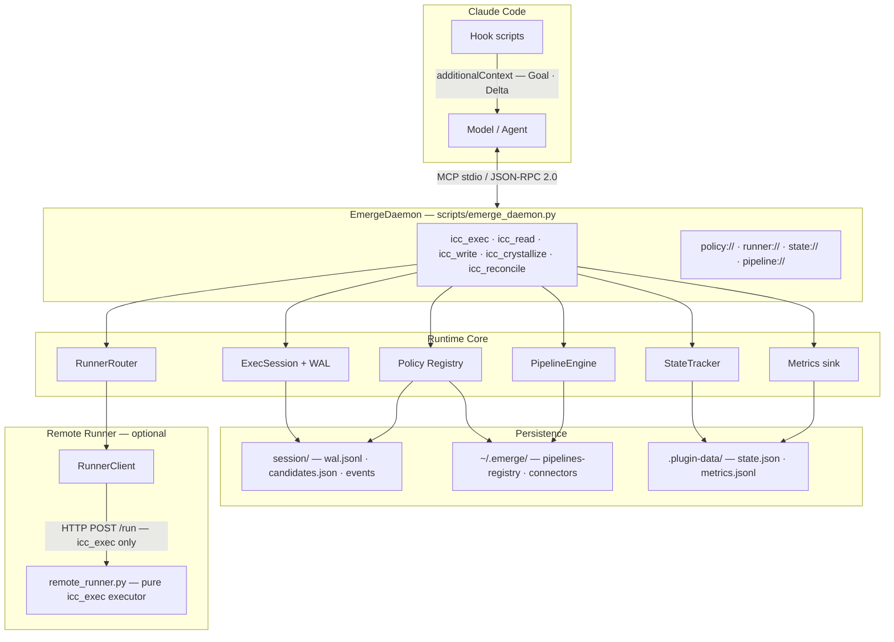
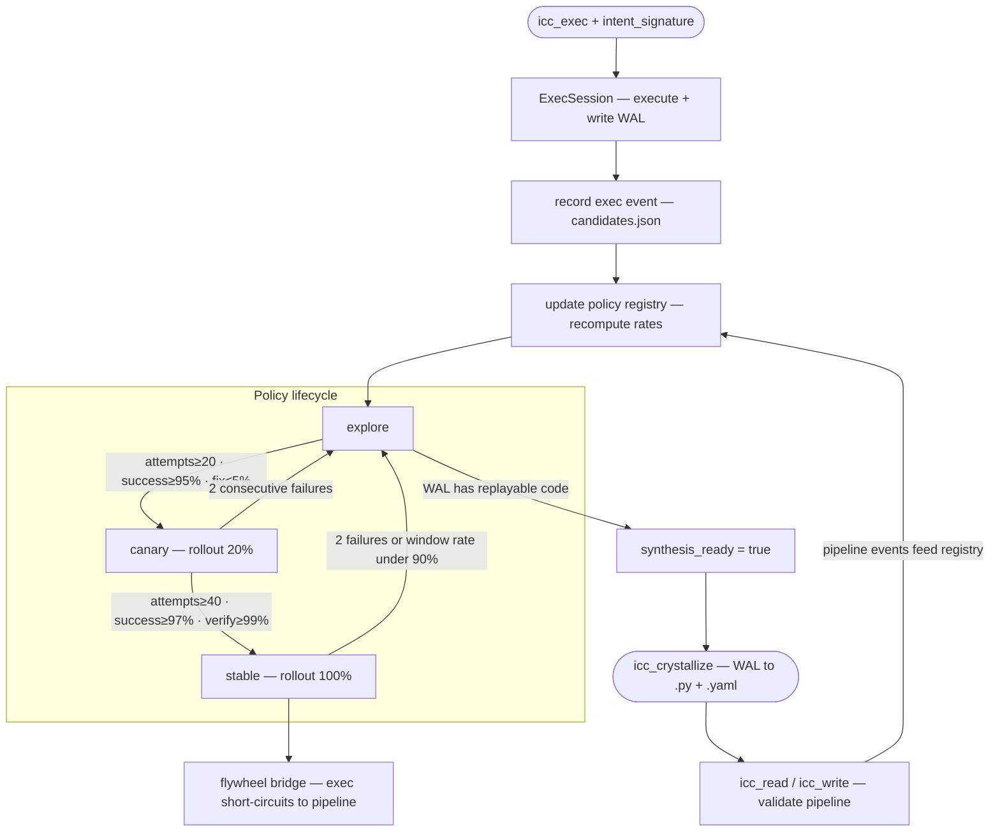
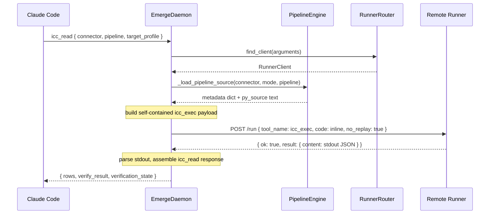
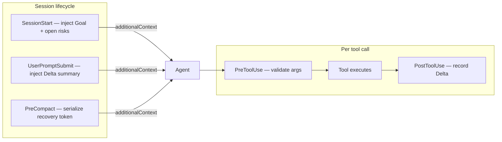

# Emerge


**Emerge** is a Claude Code plugin (v0.2.0) that implements a **muscle-memory flywheel**: repeated work is tracked via `icc_exec`, promoted through a **policy registry** (explore → canary → stable), and can be **crystallized** into connector pipelines so the same tasks run as structured `icc_read` / `icc_write` instead of ad-hoc code.

Design anchors:

- **A-track pipelines** — YAML + Python under `~/.emerge/connectors/<connector>/pipelines/` with read/write verification and rollback policy.
- **Persistent exec** — `icc_exec` runs Python in a durable session (WAL, profiles, optional remote runner).
- **State delta** — hooks and `state://deltas` keep goals, deltas, and open risks for context budgeting (`Goal` / `Delta` / `Open Risks`).

## Architecture

Emerge sits **inside the Claude Code process**: the plugin exposes one stdio MCP server and a set of hooks. The daemon is the single control plane; heavy or GUI work is delegated to an **optional HTTP remote runner** while all policy state, registry, and WAL stay local.



> **Remote pipeline execution:** When a runner is configured, `icc_read`/`icc_write` are **not** sent to the runner as-is. The daemon loads the pipeline `.py` + `.yaml` files **locally**, builds self-contained inline code, and sends it as `icc_exec` to the runner. Pipeline files never need to be copied to remote machines — switching runners is a URL change only.

**Component responsibilities:**

| Component | Role |
|-----------|------|
| **EmergeDaemon** | MCP JSON-RPC control plane: routes tool calls, orchestrates exec, pipelines, policy updates, and crystallization. |
| **ExecSession** | Persistent Python execution per profile. WAL records every successful code path for replay and crystallization. One session per `target_profile`. |
| **PipelineEngine** | Resolves `~/.emerge/connectors/` (or `EMERGE_CONNECTOR_ROOT`), loads YAML metadata + Python steps, runs `run_read`/`run_write`/`verify`/`rollback`. Also provides `_load_pipeline_source()` for remote inline execution. |
| **Policy Registry** | Tracks per-candidate lifecycle (`explore → canary → stable`), rollout %, `synthesis_ready` signal, `human_fix_rate`. Written to `pipelines-registry.json`. |
| **StateTracker** | Maintains `Goal` / `Delta` / `Open Risks` session state. Exposed via `state://deltas` resource and hook `additionalContext`. |
| **RunnerRouter** | Selects a `RunnerClient` by `target_profile` / `runner_id` (map), consistent hash (pool), or default URL. Returns `None` when no runner is configured → local execution. |
| **Hooks** | Inject minimal context at session/prompt boundaries; record `Delta` after each `icc_*` call; preserve critical state across **PreCompact**. Not a second MCP server. |

## Flows

### 1. Muscle-memory flywheel

The full lifecycle from exploratory exec to stable pipeline:



Design detail: `docs/superpowers/specs/2026-04-04-muscle-memory-flywheel-design.md`

### 2. Remote pipeline execution

When a remote runner is configured, `icc_read` / `icc_write` still run pipeline logic on the remote host — but the runner never needs connector files:



### 3. Remote runner — setup and protocol

The runner is a **pure Python executor**: it only accepts `icc_exec`. Pipeline operations (`icc_read`, `icc_write`) are handled by the daemon, which loads `.py` + `.yaml` locally, builds self-contained inline code, and sends it as `icc_exec`. No connector files ever need to exist on the runner machine — switching machines is a URL change only.

**HTTP endpoints**

| Endpoint | Purpose |
|----------|---------|
| `POST /run` | Execute one `icc_exec` call |
| `GET /health` | Liveness probe |
| `GET /status` | Process info (pid, uptime, root) |
| `GET /logs?n=N` | Last N log lines (default 100) |

Request / response shape:
```json
{ "tool_name": "icc_exec", "arguments": { "code": "...", "target_profile": "default", "no_replay": false } }
{ "ok": true,  "result": { "isError": false, "content": [{ "type": "text", "text": "..." }] } }
{ "ok": false, "error": "string message" }
```

**Configuration**

Env vars override persisted config at runtime:

| Var | Description | Default |
|-----|-------------|---------|
| `EMERGE_RUNNER_URL` | Single default runner URL | — |
| `EMERGE_RUNNER_MAP` | JSON object: `target_profile` → URL | — |
| `EMERGE_RUNNER_URLS` | Comma-separated pool of URLs | — |
| `EMERGE_RUNNER_TIMEOUT_S` | Per-request timeout (seconds) | `30` |
| `EMERGE_RUNNER_CONFIG_PATH` | Override persisted config path | `~/.emerge/runner-map.json` |

Persisted config (`~/.emerge/runner-map.json`):
```json
{
  "default_url": "http://127.0.0.1:8787",
  "map": { "mycader-1": "http://10.0.0.11:8787" },
  "pool": ["http://10.0.0.11:8787", "http://10.0.0.12:8787"]
}
```

`map` keys match `target_profile` in tool arguments. `pool` uses consistent hashing on profile/connector to pick a stable endpoint.

**Starting the runner**

```bash
# Foreground — logs written to .runner.log
python3 scripts/remote_runner.py --host 0.0.0.0 --port 8787

# Watchdog — auto-restarts on crash or .watchdog-restart signal file
pythonw scripts/runner_watchdog.py --host 0.0.0.0 --port 8787
```

For GUI/COM workloads (e.g. AutoCAD), the runner must run in an **interactive user session**, not a Windows service session.

Bootstrap helper (remote deploy + health probe + runner-map write):
```bash
python3 scripts/repl_admin.py runner-bootstrap \
  --ssh-target "user@host" \
  --target-profile "mycader-1" \
  --runner-url "http://10.0.0.11:8787"
```

### 4. Hook and context flow



## MCP surface

**Tools:**

| Tool | Purpose |
|------|---------|
| `icc_exec` | Execute Python in a persistent session. Tracks `intent_signature` for flywheel policy. Routes to remote runner if `target_profile` is mapped. |
| `icc_read` | Run a read pipeline with verification. Returns `{ rows, verify_result, verification_state }`. Falls back to structured `pipeline_missing` hint when no pipeline exists yet. |
| `icc_write` | Run a write pipeline with verification and rollback/stop policy enforcement. |
| `icc_crystallize` | Generate `.py` + `.yaml` pipeline files from WAL history. Call when `synthesis_ready: true` appears in `policy://current`. Always writes locally. |
| `icc_reconcile` | Confirm / correct / retract a StateTracker delta. `outcome=correct` + `intent_signature` increments `human_fix_rate` for the matching candidate. |

**Resources:** `policy://current` · `runner://status` · `state://deltas` · `pipeline://{connector}/{mode}/{name}`

**Prompts:** `icc_explore`

**Hooks** (`hooks/hooks.json`): `Setup` · `SessionStart` · `UserPromptSubmit` · `PreToolUse` · `PostToolUse` · `PostToolUseFailure` · `PreCompact`

## What ships in this repo

| Area | Location |
|------|----------|
| Plugin manifest | `.claude-plugin/plugin.json` (`name`: `emerge`), `.claude-plugin/marketplace.json` |
| Local MCP wiring (dev) | `.mcp.json` → `scripts/emerge_daemon.py` |
| MCP server | `scripts/emerge_daemon.py` (`EmergeDaemon`, stdio JSON-RPC) |
| Pipeline engine & policy | `scripts/pipeline_engine.py`, `scripts/policy_config.py` |
| Exec session & WAL | `scripts/exec_session.py` |
| State & metrics | `scripts/state_tracker.py`, `scripts/metrics.py` |
| Remote runner | `scripts/remote_runner.py`, `scripts/runner_client.py`, `scripts/runner_watchdog.py` |
| Ops / bootstrap | `scripts/repl_admin.py` |
| Test connector (mock) | `tests/connectors/mock/pipelines/` |
| Slash commands | `commands/` (`init`, `policy`, `runner-status`) |
| Skills | `skills/` (`initializing-vertical-flywheel`, `muscle-memory-flywheel`, `remote-runner-dev`) |
| Design spec | `docs/superpowers/specs/2026-04-04-muscle-memory-flywheel-design.md` |
| Reference (submodule) | `references/claude-code` |

## Requirements

- **Python** 3.11+
- **PyYAML** — pipeline metadata loading at runtime
- **pytest** — test suite only

## Quick verification

```bash
python -m pytest tests -q
```

Current baseline: **133** tests passing.

## Repository layout

```
scripts/            MCP daemon and runtime core
hooks/              Claude Code hook scripts
tests/              Unit and integration tests
tests/connectors/   Mock connector pipelines (test fixture, not shipped)
commands/           Slash commands bundled with plugin
skills/             Skill docs bundled with plugin
docs/superpowers/specs/   Design specifications
references/         External reference codebases (git submodule)
```

## Roadmap

<table>
<tr>
<td width="72" align="center">🟢<br><sub>shipped</sub></td>
<td><b>Solo Flywheel</b><br>
<sub>Per-session learning on a single machine. <code>icc_exec</code> accumulates history → <code>icc_crystallize</code> generates a pipeline → explore → canary → stable. Stable pipelines short-circuit at the tool layer with zero LLM overhead. Remote runner dispatch included — daemon sends self-contained inline code, runner needs no connector files.</sub>
</td>
</tr>
<tr>
<td align="center">🔵<br><sub>next</sub></td>
<td><b>Memory Hub</b><br>
<sub>Stable pipelines are pure data. Publish by <code>intent_signature</code>, install with one command, aggregate community success / human-fix rates. Parameterized connectors strip local paths before publish. Diff-aware re-crystallize auto-demotes when the connector API changes.</sub>
</td>
</tr>
<tr>
<td align="center">🟡<br><sub>planned</sub></td>
<td><b>Federated Execution Grid</b><br>
<sub>Multiple runners with capability tags (<code>zwcad</code>, <code>cuda12</code>, <code>android-emu</code>). <code>RunnerRouter</code> picks by capability, not just URL. Failover to next capable host. Cross-session policy: a failure on one machine can demote the pipeline globally.</sub>
</td>
</tr>
<tr>
<td align="center">🔮<br><sub>research</sub></td>
<td><b>Split-Personality Flywheel</b><br>
<sub>Today the flywheel crystallizes <i>actions</i> → deterministic pipelines (no LLM). Next: crystallize <i>reasoning patterns</i> → specialized subagent personas (compressed system prompt + tools + few-shot traces). Subagents dispatch to stable pipelines. Two tiers of crystallization — code where the task is deterministic, compressed mind where it isn't.</sub>
</td>
</tr>
</table>

## Reference sources

Claude Code source is vendored under `references/` as read-only context so the Emerge implementation can evolve independently.
