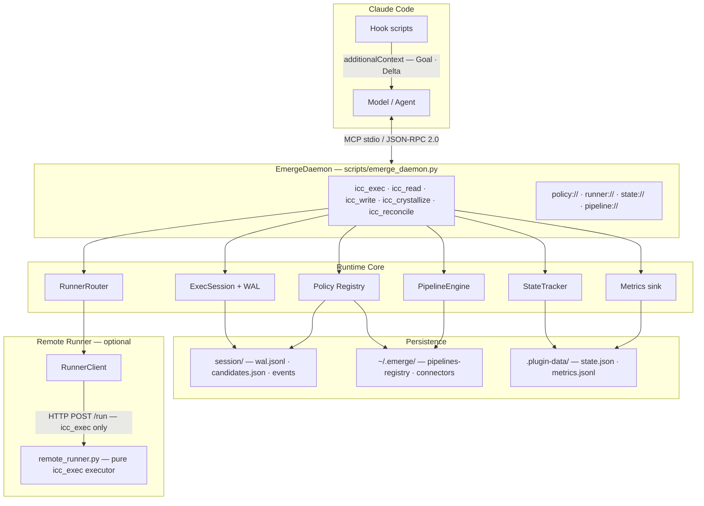
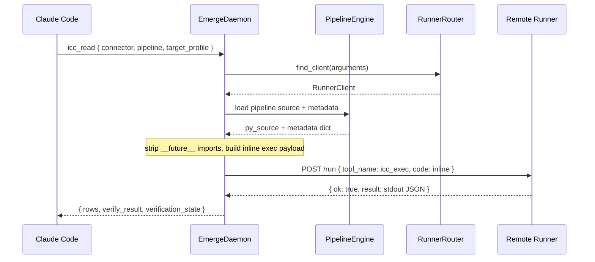
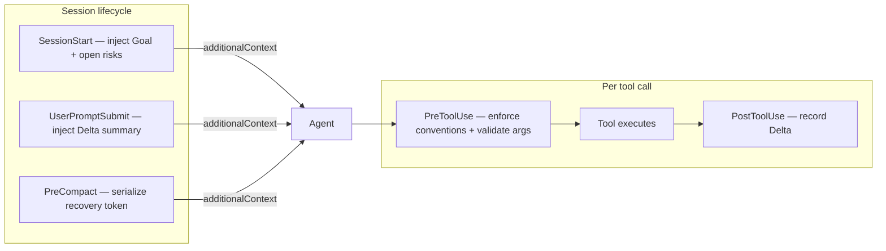

# Emerge


**Emerge** is a Claude Code plugin (v0.2.0) that implements a **muscle-memory flywheel**: repeated work is tracked via `icc_exec`, promoted through a **policy registry** (explore → canary → stable), and can be **crystallized** into connector pipelines so the same tasks run as structured `icc_read` / `icc_write` instead of ad-hoc code.

Design anchors:

- **Connector pipelines** — YAML + Python under `~/.emerge/connectors/<connector>/pipelines/`, with verification and rollback policy baked in.
- **Persistent exec** — `icc_exec` runs Python in a durable local session (WAL + profiles). A remote runner is optional — local is the default.
- **State delta** — hooks and `state://deltas` keep goals, deltas, and open risks for context budgeting (`Goal` / `Delta` / `Open Risks`).

## Architecture

Emerge sits **inside the Claude Code process**: the plugin exposes one stdio MCP server and a set of hooks. The daemon is the single control plane; heavy or GUI work is delegated to an **optional HTTP remote runner** while all policy state, registry, and WAL stay local.



**Component responsibilities:**

| Component | Role |
|-----------|------|
| **EmergeDaemon** | MCP JSON-RPC control plane: routes tool calls, orchestrates exec, pipelines, policy updates, and crystallization. |
| **ExecSession** | Persistent Python execution per profile. WAL records every successful code path for replay and crystallization. One session per `target_profile`. |
| **PipelineEngine** | Resolves `~/.emerge/connectors/` (or `EMERGE_CONNECTOR_ROOT`), loads YAML metadata + Python steps, runs `run_read`/`run_write`/`verify`/`rollback`. Also provides `_load_pipeline_source()` for remote inline execution. |
| **Policy Registry** | Tracks per-candidate lifecycle (`explore → canary → stable`), rollout %, `synthesis_ready` signal, `human_fix_rate`. Written to `pipelines-registry.json`. |
| **StateTracker** | Maintains `Goal` / `Delta` / `Open Risks` session state. Exposed via `state://deltas` resource and hook `additionalContext`. |
| **RunnerRouter** | Selects a `RunnerClient` by `target_profile` / `runner_id` (map), consistent hash (pool), or default URL. Returns `None` when no runner is configured → local execution. |
| **Flywheel bridge** | Short-circuit inside `icc_exec`: when the matching candidate is `stable`, execution is redirected to the pipeline result without LLM inference. Zero overhead path once a pattern is trusted. |
| **Hooks** | Inject minimal context at session/prompt boundaries; record `Delta` after each `icc_*` call; preserve critical state across **PreCompact**. `PreToolUse` enforces `intent_signature` required on `icc_exec` and blocks calls that violate exec conventions. Not a second MCP server. |

## Flows

### 1. Muscle-memory flywheel lifecycle

The full lifecycle from exploratory exec to stable pipeline:


### 2. Pipeline execution

`icc_read` and `icc_write` have two execution paths depending on whether a remote runner is configured.

**Local (default).** The daemon calls the pipeline engine in-process. No network, no subprocess.

```
icc_read { connector, pipeline }
  → PipelineEngine.run_read(args)
  → { rows, verify_result, verification_state }
```

**Remote.** When `RunnerRouter` resolves a client for the request, the daemon loads the pipeline source locally, builds a self-contained `icc_exec` payload, and dispatches it over HTTP. The runner machine never needs connector files — a machine change is a URL change only.



### 3. Remote runner — operations

The runner is a **stateless Python executor** — it accepts `icc_exec` only. All pipeline logic, policy decisions, and state writes happen in the daemon.

**Endpoints**

| Endpoint | Purpose |
|---|---|
| `POST /run` | Execute one `icc_exec` call |
| `GET /health` | Liveness — `{"ok": true, "uptime_s": N}` |
| `GET /status` | Process info (pid, python, root) |
| `GET /logs?n=N` | Last N log lines |

**Configuration**

| Env var | Purpose | Default |
|---|---|---|
| `EMERGE_RUNNER_URL` | Single default runner | — |
| `EMERGE_RUNNER_MAP` | JSON `target_profile → URL` | — |
| `EMERGE_RUNNER_URLS` | Comma-separated URL pool | — |
| `EMERGE_RUNNER_TIMEOUT_S` | Per-request timeout (s) | `30` |
| `EMERGE_OPERATOR_MONITOR` | Enable OperatorMonitor thread in daemon | `0` |
| `EMERGE_MONITOR_POLL_S` | EventBus poll interval (seconds) | `5` |
| `EMERGE_MONITOR_MACHINES` | Comma-separated runner profile names to monitor | all configured |

Persisted route map (`~/.emerge/runner-map.json`):
```json
{
  "default_url": "http://127.0.0.1:8787",
  "map":  { "cad-win": "http://10.0.0.11:8787" },
  "pool": [ "http://10.0.0.11:8787", "http://10.0.0.12:8787" ]
}
```

`map` keys match `target_profile` in tool arguments. `pool` uses consistent hashing so the same profile always lands on the same host.

**Starting**

```bash
# Standard — logs to .runner.log
python3 scripts/remote_runner.py --host 0.0.0.0 --port 8787

# With watchdog — auto-restarts on crash or .watchdog-restart signal
pythonw scripts/runner_watchdog.py --host 0.0.0.0 --port 8787
```

> **Windows / GUI workloads** (AutoCAD, ZWCAD, COM objects): launch from an interactive desktop session (RDP/console), not a Windows service. COM objects are session-scoped.

**One-command bootstrap** (deploy → start → health-check → persist route):
```bash
python3 scripts/repl_admin.py runner-bootstrap \
  --ssh-target "user@10.0.0.11" \
  --target-profile "cad-win" \
  --runner-url "http://10.0.0.11:8787"
```

### 4. Hook and context flow



## MCP surface

**Tools:**

| Tool | Purpose |
|------|---------|
| `icc_exec` | Execute Python in a persistent local session. Tracks `intent_signature` for flywheel policy. Optionally routes to a remote runner when `target_profile` is mapped — local is the default. |
| `icc_read` | Run a read pipeline locally (default) or via remote runner. Returns `{ rows, verify_result, verification_state }`. Returns a structured `pipeline_missing` hint when no pipeline exists yet. |
| `icc_write` | Run a write pipeline locally (default) or via remote runner, with verification and rollback/stop policy enforcement. |
| `icc_crystallize` | Generate `.py` + `.yaml` pipeline files from WAL history. Call when `synthesis_ready: true` appears in `policy://current`. Always writes locally. |
| `icc_reconcile` | Confirm or correct a state delta. `outcome=correct` + `intent_signature` increments `human_fix_rate` on the most-recently-used matching candidate. |

**Resources:** `policy://current` · `runner://status` · `state://deltas` · `pipeline://{connector}/{mode}/{name}`

**Prompts:** `icc_explore`

**Hooks** (`hooks/hooks.json`): `Setup` · `SessionStart` · `UserPromptSubmit` · `PreToolUse` · `PostToolUse` · `PostToolUseFailure` · `PreCompact`

## What ships in this repo

| Area | Location |
|------|----------|
| Plugin manifest | `.claude-plugin/plugin.json` (`name`: `emerge`), `.claude-plugin/marketplace.json` |
| Local MCP wiring (dev) | `.mcp.json` → `scripts/emerge_daemon.py` |
| MCP server | `scripts/emerge_daemon.py` (`EmergeDaemon`, stdio JSON-RPC) |
| Pipeline engine & policy | `scripts/pipeline_engine.py`, `scripts/policy_config.py` |
| ExecSession & WAL | `scripts/exec_session.py` |
| State & metrics | `scripts/state_tracker.py`, `scripts/metrics.py` |
| Remote runner | `scripts/remote_runner.py`, `scripts/runner_client.py`, `scripts/runner_watchdog.py` |
| Observer framework | `scripts/observer_plugin.py`, `scripts/observers/` |
| Pattern detector | `scripts/pattern_detector.py` |
| Distiller | `scripts/distiller.py` |
| Operator monitor | `scripts/operator_monitor.py` |
| Ops / bootstrap | `scripts/repl_admin.py` |
| Test connector (mock) | `tests/connectors/mock/pipelines/` |
| Slash commands | `commands/` (`init`, `policy`, `runner-status`) |
| Skills | `skills/` (`initializing-vertical-flywheel`, `remote-runner-dev`, `writing-vertical-adapter`, `operator-monitor-debug`) |
| Reference (submodule) | `references/claude-code` |

## Requirements

- **Python** 3.11+
- **PyYAML** — pipeline metadata loading at runtime
- **pytest** — test suite only

## Quick verification

```bash
python -m pytest tests -q
```

Current baseline: **157** tests passing.

## Repository layout

```
scripts/            MCP daemon and runtime core
hooks/              Claude Code hook scripts
tests/              Unit and integration tests
tests/connectors/   Mock connector pipelines (test fixture, not shipped)
commands/           Slash commands bundled with plugin
skills/             Skill docs bundled with plugin
docs/superpowers/specs/   Design specifications
references/         External reference codebases (git submodule)
```

## Roadmap

<table>
<tr>
<td width="72" align="center">🟢<br><sub>shipped</sub></td>
<td><b>Solo Flywheel</b><br>
<sub>Per-session learning on a single machine. <code>icc_exec</code> accumulates history → <code>icc_crystallize</code> generates a pipeline → explore → canary → stable. Stable pipelines short-circuit at the tool layer with zero LLM overhead. Remote runner dispatch included — daemon sends self-contained inline code, runner needs no connector files.</sub>
</td>
</tr>
<tr>
<td align="center">🟢<br><sub>shipped</sub></td>
<td><b>Operator Intelligence Loop</b><br>
<sub>A reverse flywheel that observes the <i>human</i>, not just the AI. A background monitor audits operator behavior on a configurable time window (default 5 min) — surfacing a native GUI popup: <i>"you've done this 8 times today — why? want me to take it?"</i> Intent is captured, patterns are distilled into operator skill profiles, and repetitive sequences are handed off to the AI layer. The goal: progressively free operators from work that is mechanical, high-frequency, or already crystallized somewhere in the pipeline registry. Operator as author, not executor.</sub>
</td>
</tr>
<tr>
<td align="center">🟡<br><sub>planned</sub></td>
<td><b>Memory Hub</b><br>
<sub>Stable pipelines are pure data. Publish by <code>intent_signature</code>, install with one command, aggregate community success / human-fix rates. Parameterized connectors strip local paths before publish. Diff-aware re-crystallize auto-demotes when the connector API changes.</sub>
</td>
</tr>
<tr>
<td align="center">🟡<br><sub>planned</sub></td>
<td><b>Federated Execution Grid</b><br>
<sub>Multiple runners with capability tags (<code>zwcad</code>, <code>cuda12</code>, <code>android-emu</code>). <code>RunnerRouter</code> picks by capability, not just URL. Failover to next capable host. Cross-session policy: a failure on one machine can demote the pipeline globally.</sub>
</td>
</tr>
<tr>
<td align="center">🔮<br><sub>research</sub></td>
<td><b>Split-Personality Flywheel</b><br>
<sub>Today the flywheel crystallizes <i>actions</i> → deterministic pipelines (no LLM). Next: crystallize <i>reasoning patterns</i> → specialized subagent personas (compressed system prompt + tools + few-shot traces). Subagents dispatch to stable pipelines. Two tiers of crystallization — code where the task is deterministic, compressed mind where it isn't.</sub>
</td>
</tr>
</table>

## Glossary

| Term | Definition |
|---|---|
| **Adapter** | An `ObserverPlugin` subclass that provides application-specific observation and takeover capability for a specific vertical (e.g. ZWCAD COM, Excel). Generic built-in observers (`accessibility`, `filesystem`, `clipboard`) ship with the framework; vertical adapters are crystallized from WAL history via `icc_crystallize mode=adapter` and live in `~/.emerge/adapters/<vertical>/adapter.py`. |
| **Candidate** | A tracked execution pattern identified by `intent_signature`. Carries policy counters (attempts, successes, human-fix rate) that drive lifecycle transitions. Multiple candidates can share the same `intent_signature` (e.g. exec vs pipeline variants). |
| **Connector** | A named integration target (e.g. `zwcad`, `mock`). Owns pipeline definitions under `~/.emerge/connectors/<connector>/pipelines/read/` and `.../write/`. |
| **Crystallization** | Generating a deterministic `.py` + `.yaml` pipeline from WAL history via `icc_crystallize`. Converts accumulated exec knowledge into a reusable, verifiable pipeline. |
| **EventBus** | Append-only JSONL file per machine at `~/.emerge/operator-events/<machine_id>/events.jsonl`. Written by `ObserverPlugin` instances on the operator machine via `POST /operator-event` to the remote runner. Consumed by `OperatorMonitor` via `GET /operator-events`. |
| **Flywheel bridge** | Short-circuit inside `icc_exec`: when the matching candidate is `stable`, the call is redirected to the pipeline result with zero LLM inference. |
| **Intent signature** | Dot-notation string (e.g. `zwcad.read.state`) that identifies the semantic intent of an `icc_exec` call. The policy flywheel tracks all counters per intent signature. |
| **ObserverPlugin** | Abstract base class for operator behavior observation. Defines four methods: `start(config)`, `stop()`, `get_context(hint) -> dict` (pre-elicitation context read), `execute(intent, params) -> dict` (takeover). Mirrors the `Pipeline` contract for the reverse flywheel. |
| **OperatorMonitor** | Background thread inside `EmergeDaemon` (enabled via `EMERGE_OPERATOR_MONITOR=1`). Polls remote runners for operator events, runs `PatternDetector`, calls `adapter.get_context()` for pre-elicitation context, then pushes to CC via MCP channel notification (explore stage) or `ElicitRequest` (canary/stable). |
| **PatternDetector** | Analyses batches of operator events and emits `PatternSummary` objects when thresholds are crossed. Pluggable strategies: frequency (3 same-type events in 20 min), error-rate (undo ratio ≥ 0.4), cross-machine (same pattern on ≥2 machines). Filters out `session_role=monitor_sub` events to prevent AI self-monitoring. |
| **Pipeline** | YAML + Python pair implementing a deterministic `run_read` / `run_write` / `verify` / `rollback` contract. Lives in the connector directory; never needs to exist on the runner machine. |
| **Policy lifecycle** | Three-stage promotion path: `explore` (accumulating history, 0% rollout) → `canary` (partial rollout, 20%) → `stable` (full trust, 100%). Demotion on consecutive failures or low window success rate. |
| **Reverse flywheel** | The Operator Intelligence Loop: observes the human operator (not the AI), detects repeated patterns, surfaces a CC dialog to capture intent, and hands off to the AI layer. Feeds the same policy registry and crystallization mechanism as the forward flywheel. |
| **State delta** | A recorded change in system state maintained by `StateTracker`. Surfaced via hooks as `additionalContext` to keep the agent aware of what has changed since the last prompt. |
| **Target profile** | String key (e.g. `default`, `cad-win`) that identifies an execution environment. Routes `icc_exec` to the matching remote runner or local `ExecSession`. |
| **WAL** | Write-ahead log — append-only record of successful `icc_exec` code paths per session profile. Primary source material for crystallization. |

## Reference sources

Claude Code source is vendored under `references/` as read-only context so the Emerge implementation can evolve independently.
