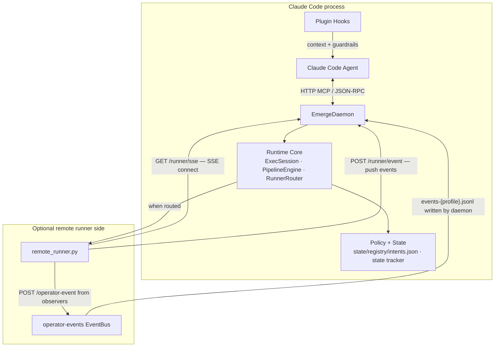
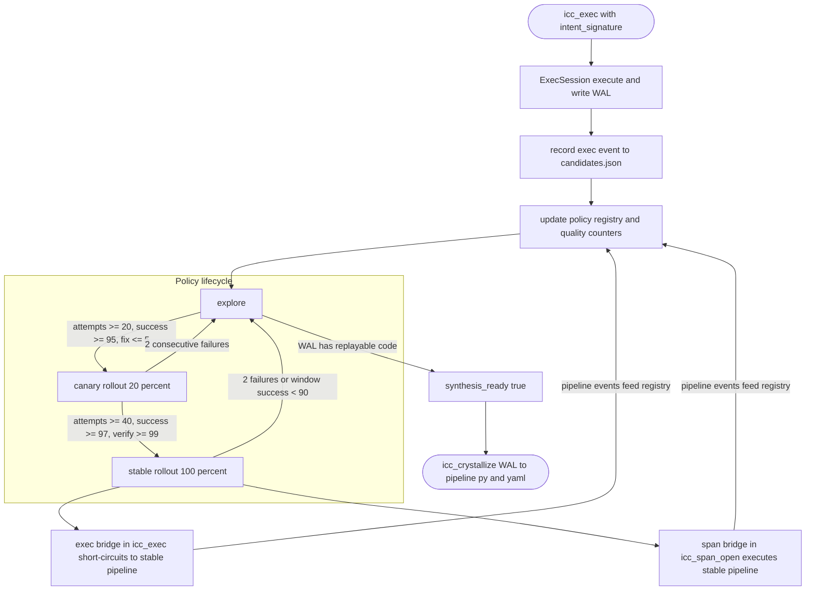
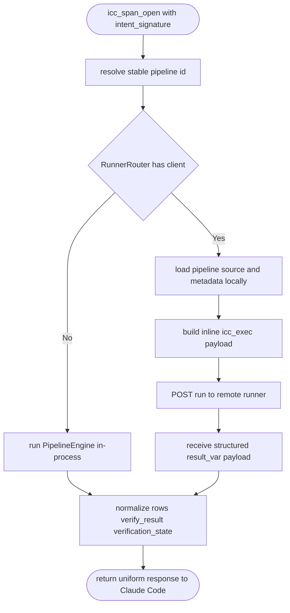
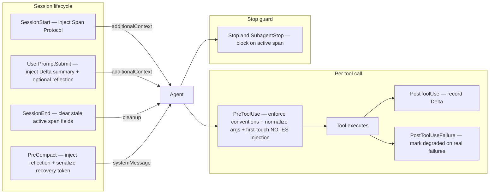
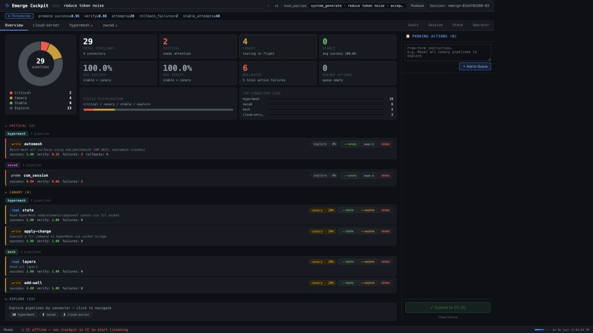
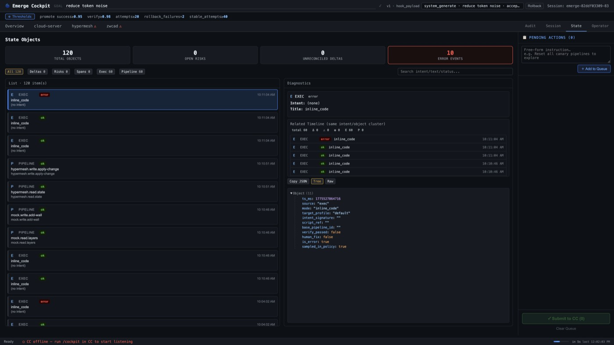
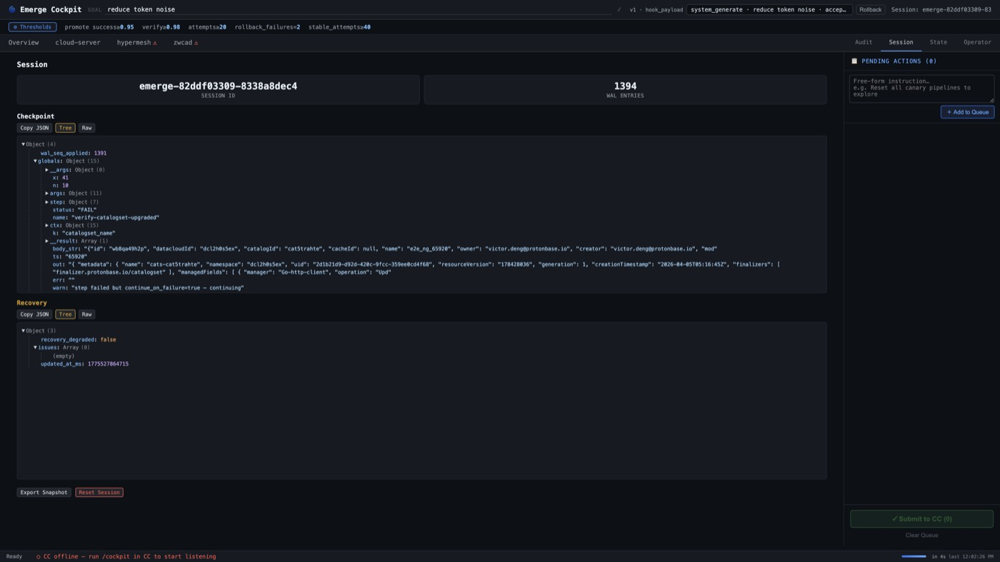

# Emerge


**Emerge** solves a core problem: AI operators repeat the same work but do not learn from it, so every session re-reasons from scratch. It uses a **dual flywheel** to crystallize repeated work into deterministic pipelines: a **forward flywheel** (`icc_exec`/`icc_span_open` tracking → policy promotion explore→canary→stable → auto-crystallized `.py+.yaml` pipelines → zero-LLM execution), and a **reverse flywheel** (`OperatorMonitor` observes human operators → `PatternDetector` detects repetition → confirmation/approval captures intent → AI takes over).

**Emerge** is a Claude Code plugin that implements a **dual flywheel**: repeated AI work is tracked via `icc_exec` (ad-hoc code) and `icc_span_open/close` (intent spans), promoted through a **policy registry** (explore → canary → stable), and **crystallized** into connector pipelines that execute with zero LLM inference once stable. A reverse flywheel watches human operators via `OperatorMonitor`, detects repetition with `PatternDetector`, and hands tasks to the AI.

Design anchors:

- **Connector pipelines** — strict YAML metadata + Python under `~/.emerge/connectors/<connector>/pipelines/`, with verification and rollback policy baked in.
- **Persistent exec** — `icc_exec` runs Python in a durable local session (WAL + profiles). A remote runner is optional — local is the default.
- **State delta** — hooks and `state://deltas` keep deltas and open risks for context budgeting (`Delta` / `Open Risks`).

## Architecture

Emerge sits **inside the Claude Code process**: the plugin exposes one HTTP MCP server (port 8789) and a set of hooks. The daemon is the single control plane; heavy or GUI work is delegated to an **optional HTTP remote runner** while all policy state, registry, and WAL stay local.




**Component responsibilities:**


| Component           | Role                                                                                                                                                                                                                                                                                 |
| ------------------- | ------------------------------------------------------------------------------------------------------------------------------------------------------------------------------------------------------------------------------------------------------------------------------------ |
| **EmergeDaemon**    | MCP JSON-RPC control plane: routes tool calls, orchestrates exec, pipelines, policy updates, and crystallization.                                                                                                                                                                    |
| **ExecSession**     | Persistent Python execution per profile. WAL records every successful code path for replay and crystallization. One session per `target_profile`.                                                                                                                                    |
| **PipelineEngine**  | Resolves `~/.emerge/connectors/` (or `EMERGE_CONNECTOR_ROOT`), loads strict YAML metadata + Python steps, runs `run_read`/`run_write`/`verify`/`rollback`. Also provides `_load_pipeline_source()` for remote inline execution.                                                      |
| **Intent Registry** | Tracks per-intent lifecycle (`explore → canary → stable`), rollout %, `synthesis_ready` signal, `human_fix_rate`, and `last_execution_path` (`local`/`remote`). Written to `state/registry/intents.json`.                                                                                                                           |
| **PolicyEngine**    | Single authoritative writer for `state/registry/intents.json` `stage` field. Evidence producers (span close, exec/pipeline events, `icc_reconcile`) hand raw outcomes to `apply_evidence`; the engine updates counters, re-derives stage via `_derive_transition`, appends a bounded `transition_history` record on every stage change, mirrors demotions onto `last_demotion` for rollback attribution, and fires side effects (auto-crystallize, hub sync, MCP push). Read-only inspection uses `derive_stage(entry)`; cockpit audit via `/api/control-plane/intent-history`. |
| **StateTracker**    | Maintains `Delta` / `Open Risks` session state and recovery token budgeting.                                                                                                                                                |
| **RunnerRouter**    | Selects a `RunnerClient` by `target_profile` / `runner_id` (map), consistent hash (pool), or default URL. Returns `None` when no runner is configured → local execution.                                                                                                             |
| **Flywheel bridge** | Short-circuit inside `icc_exec`: when the matching candidate is `stable`, execution is redirected to the pipeline result without LLM inference. Zero overhead path once a pattern is trusted.                                                                                        |
| **Hooks**           | Inject minimal context at session/prompt boundaries (Span Protocol + compact connector index at SessionStart, bounded muscle-memory reflection on turn 1 / compact boundaries), record `Delta` after each `icc_`* call, preserve recovery state across **PreCompact**, and guard stop/exit with active-span safety checks. `PreToolUse` enforces `intent_signature` conventions, auto-normalizes uppercase signatures via `updatedInput`, injects connector `NOTES.md` on first approved tool call per connector (session-scoped de-dup), and returns `ask` for `icc_span_approve` and destructive `icc_hub` resolve. Not a second MCP server. |
| **`emerge_sync.py`** | Memory Hub sync agent. Bidirectional connector asset sync via orphan-branch git repo; event-driven push on stable promotion, periodic pull, AI-assisted conflict resolution via `icc_hub` MCP tool. |


## Flows

### 1. Muscle-memory flywheel lifecycle

The full lifecycle from exploratory exec to stable pipeline:




### 2. Pipeline execution

Stable pipeline execution uses the `icc_span_open` bridge: when an intent is stable, the bridge short-circuits directly to the pipeline result with zero LLM overhead.

**Local (default).** The daemon calls the pipeline engine in-process. No network, no subprocess.

```
icc_span_open { intent_signature }
  → bridge resolves stable pipeline
  → PipelineEngine.run_read(args)
  → { rows, verify_result, verification_state }
```

**Remote.** When `RunnerRouter` resolves a client for the request, the daemon loads the pipeline source locally, builds a self-contained `icc_exec` payload, and dispatches it over HTTP. The runner machine never needs connector files — a machine change is a URL change only. Pipeline calls request a structured `result_var` from the runner, so parsing does not depend on stdout text. Local and remote paths return the same response shape and verification semantics.




### 3. Remote runner — operations

The runner is a **stateless Python executor** — it accepts `icc_exec` only. All pipeline logic, policy decisions, and state writes happen in the daemon.

**Endpoints**


| Endpoint        | Purpose                                  |
| --------------- | ---------------------------------------- |
| `POST /run`     | Execute one `icc_exec` call              |
| `GET /health`   | Liveness — `{"ok": true, "uptime_s": N}` |
| `GET /status`   | Process info (pid, python, root)         |
| `GET /logs?n=N` | Last N log lines                         |

**Daemon (team-lead) — operator self-install**

| Endpoint | Purpose |
| -------- | ------- |
| `GET /runner-install.sh?port=<n>` | Generated bash installer (embeds LAN daemon URL) |
| `GET /runner-install.ps1?port=<n>` | Generated PowerShell installer |
| `GET /runner-dist/runner.tar.gz` | Bundle of runner scripts + `requirements-runner.txt` |
| `GET /runner-dist/runner.tar.gz.sha256` | SHA256 checksum for installer integrity verification |

CLI: `python3 scripts/repl_admin.py runner-install-url --target-profile <p> --pretty`. Cockpit: `GET /api/control-plane/runner-install-url?profile=<p>`.

Installer URLs point at your machine’s LAN address (`http://<lan-ip>:<port>/…`). The HTTP MCP daemon listens on **loopback by default** (`127.0.0.1`). To let another host download `/runner-install.*` or `/runner-dist/runner.tar.gz`, set **`EMERGE_DAEMON_BIND=0.0.0.0`** (or bind a specific interface IP) and ensure the host firewall allows inbound TCP on the daemon port. Binding all interfaces exposes the MCP endpoint on the LAN — restrict access if needed.


**Configuration**


| Env var                   | Purpose                                         | Default        |
| ------------------------- | ----------------------------------------------- | -------------- |
| `EMERGE_DAEMON_BIND`    | IP address for the HTTP MCP daemon to bind (`0.0.0.0` = all interfaces, for LAN self-install) | `127.0.0.1` |
| `EMERGE_RUNNER_URL`       | Single default runner                           | —              |
| `EMERGE_RUNNER_MAP`       | JSON `target_profile → URL`                     | —              |
| `EMERGE_RUNNER_URLS`      | Comma-separated URL pool                        | —              |
| `EMERGE_RUNNER_TIMEOUT_S` | Per-request timeout (s)                         | `30`           |
| `EMERGE_OPERATOR_MONITOR` | Enable OperatorMonitor thread in daemon         | `0`            |
| `EMERGE_MONITOR_POLL_S`   | EventBus poll interval (seconds)                | `5`            |
| `EMERGE_MONITOR_MACHINES` | Comma-separated runner profile names to monitor | `default` |
| `EMERGE_STATE_ROOT`         | Override where session state (WAL, checkpoints, registry) is written | `~/.emerge/state` |
| `EMERGE_SESSION_ID`         | Override the derived session identifier                               | derived from cwd+git  |
| `EMERGE_RUNNER_CONFIG_PATH` | Path to `runner-map.json` (overrides default location)               | `~/.emerge/runner-map.json` |
| `EMERGE_SETTINGS_PATH`      | Override settings file path                                           | `~/.emerge/settings.json` |
| `EMERGE_SCRIPT_ROOTS`       | Comma-separated allowed roots for `script_ref` resolution             | project root |
| `EMERGE_TARGET_PROFILE`     | Default runner target profile for `repl_admin` commands              | `default` |
| `EMERGE_COCKPIT_DISABLE`    | `1` to disable the `EventRouter` watchdog in the daemon              | enabled   |
| `EMERGE_HOOK_STATE_ROOT`    | Hook state root (`state.json`, span WAL, reflection cache) — test isolation only | `~/.emerge/hook-state` |
| `EMERGE_EXEC_TIMEOUT_S`     | Wall-clock cap (seconds) for each `icc_exec` call                                 | `120`                 |
| `EMERGE_EXEC_STDOUT_BYTES`  | Max captured `stdout` bytes per exec (excess truncated with a warning)           | `262144`              |
| `EMERGE_EXEC_STDERR_BYTES`  | Max captured `stderr` bytes per exec (excess truncated with a warning)           | `65536`               |
| `EMERGE_SESSION_IDLE_TTL_S` | Evict `ExecSession` handles idle longer than this; `0` disables eviction         | `3600`                |
| `EMERGE_WATCHER_STALE_S`    | `watch_emerge` heartbeat must refresh within this window to be "alive"           | `60`                  |


Persisted route map (`~/.emerge/runner-map.json`):

```json
{
  "default_url": "http://127.0.0.1:8787",
  "map":  { "cad-win": "http://10.0.0.11:8787" },
  "pool": [ "http://10.0.0.11:8787", "http://10.0.0.12:8787" ]
}
```

`map` keys match `target_profile` in tool arguments. `pool` uses consistent hashing so the same profile always lands on the same host.

**Starting**

```bash
# Standard — logs to .runner.log
python3 scripts/remote_runner.py --host 0.0.0.0 --port 8787

# With watchdog — auto-restarts on crash or .watchdog-restart signal
pythonw scripts/runner_watchdog.py --host 0.0.0.0 --port 8787
```

> **Windows / GUI workloads** (AutoCAD, ZWCAD, COM objects): launch from an interactive desktop session (RDP/console), not a Windows service. COM objects are session-scoped.

**Operator self-install** (copy-paste on the runner machine — no SSH from the dev machine):

```bash
python3 scripts/repl_admin.py runner-install-url --target-profile "cad-win" --pretty
# Or open Cockpit → Monitors → Add Runner and copy the curl / irm commands.
```

Installer defaults runner profile to hostname; override explicitly with `EMERGE_PROFILE=<name>` (bash) or `$env:EMERGE_PROFILE="<name>"` (PowerShell) before running install.
On Linux, installer autostart preference order is: `systemd --user` → `cron @reboot` → XDG autostart desktop entry → current-session watchdog only. The final install line prints `start_mode=...`.
On Windows, autostart preference is: registry `HKCU\...\Run` → Startup folder fallback → current-session watchdog only. Install failures are tagged with stage markers (`[Install][download]`, `[Install][extract]`, etc.) for faster troubleshooting.

### 4. Hook and context flow



### Context injection budget

Hook injections are bounded and on-demand. Actual overhead per turn:

| Trigger | Payload | Size |
|---|---|---|
| SessionStart | Compact connector index (`Available connectors: ...`) | ~0–200 chars |
| Every turn (UserPromptSubmit) | FLYWHEEL_TOKEN recovery token | ~213 chars (empty), scales with active deltas/risks |
| Turn 1 only | Reflection summary (stable ≤ 8, canary ≤ 3, recent ≤ 5) | 0 if no intents, ~300–500 chars when active |
| Every 5 turns, no active span | Span reminder | ~110 chars |
| First approved call per connector (PreToolUse) | Full `NOTES.md` content | ≤ 1200 chars, once per connector per session |
| PreCompact / PostCompact | Reflection + FLYWHEEL_TOKEN | Same as above, triggered by context pressure |

Delta/Risk context is budget-capped: `format_additional_context(budget_chars=N)` allocates at most 1/3 of the budget to risks, newest-first. Content beyond the budget is collapsed to a count with a pointer to `state://deltas`.

The dominant context consumers are the conversation history and `CLAUDE.md` (user-authored). Hook injections are negligible by comparison.


## MCP surface

**Tools:**


| Tool              | Purpose                                                                                                                                                                                      |
| ----------------- | -------------------------------------------------------------------------------------------------------------------------------------------------------------------------------------------- |
| `icc_span_open`   | Open an intent span to track a multi-step MCP tool call sequence. PostToolUse records every subsequent tool call into the span buffer. At stable, bridges directly to PipelineEngine (zero LLM inference). |
| `icc_span_close`  | Close the current span and commit to the span WAL. At stable, auto-generates a Python skeleton in `_pending/` for human review.                                                              |
| `icc_span_approve` | Move the completed skeleton from `_pending/` to the real pipeline directory and generate YAML metadata. Activates the span bridge for future calls.                                         |
| `icc_exec`        | Execute Python in a persistent local session. Tracks `intent_signature` for flywheel policy. Optionally routes to a remote runner when `target_profile` is mapped — local is the default. Supports `result_var` to return structured JSON from a named global variable. At synthesis_ready, auto-crystallizes WAL into a pipeline. |
| `icc_crystallize` | Generate `.py` + `.yaml` pipeline files from WAL history (manual override). Always writes locally; force-overwrites existing files.                                                          |
| `icc_reconcile`   | Confirm or correct a state delta. `outcome=correct` + `intent_signature` increments `human_fix_rate` on the most-recently-used matching candidate.                                           |
| `icc_compose`     | Register a **composite** intent (`intent_signature` + ordered `children` of existing intents). Stage inherits `min(children.stage)`; at stable, bridge runs each child's pipeline in order, passing prior output as `__prev_result` (same path for `icc_exec` and `icc_span_open`). |
| `icc_hub`           | Memory Hub management: `configure` (first-time setup — saves config + initialises git worktree, callable from CC via natural language) · `list` config · `add`/`remove` connectors · `sync` (enqueue push+pull) · `status` (pending conflicts + awaiting-application count) · `resolve` conflicts (`ours`/`theirs`/`skip`). |


**Resources:** `policy://current` · `runner://status` · `state://deltas` · `pipeline://{connector}/{mode}/{name}` · `connector://{vertical}/notes` · `connector://{vertical}/intents` · `connector://{vertical}/spans`

**JSON-RPC (HTTP `POST /mcp`):** `resources/list` · `resources/read` · `resources/templates/list` (static URI templates for the schemes above) · `prompts/list` · `prompts/get`. One-way MCP notifications (`method` starting with `notifications/`) have no JSON-RPC response body; the server answers **HTTP 202 Accepted** with an empty body.

**Prompts:** `icc_explore`

**Hooks** (`hooks/hooks.json`): `Setup` · `SessionStart` · `SessionEnd` · `UserPromptSubmit` · `PreToolUse` · `PostToolUse` · `PostToolUseFailure` · `PreCompact` · `PostCompact` · `Stop` · `SubagentStop` · `StopFailure` · `TaskCompleted` · `SubagentStart` · `TeammateIdle` · `PermissionRequest` · `PermissionDenied` · `InstructionsLoaded` · `WorktreeCreate` · `WorktreeRemove` · `TaskCreated` · `CwdChanged` · `Elicitation` · `ElicitationResult`

### MCP protocol compliance (2025-11-25)

Emerge follows MCP 2025-11-25 style metadata and hook control semantics:

- Tool schemas include `title`, `annotations`, and `outputSchema`.
- Server version negotiation returns `min(client_version, "2025-11-25")`.
- `PreToolUse` uses `hookSpecificOutput.permissionDecision` (`allow`/`deny`/`ask`) rather than legacy top-level block format.
- `PostToolUse` can inject `updatedMCPToolOutput` for span correlation (`_span_id`, `_span_intent`).

## What ships in this repo


| Area                     | Location                                                                                                                                       |
| ------------------------ | ---------------------------------------------------------------------------------------------------------------------------------------------- |
| Plugin manifest          | `.claude-plugin/plugin.json` (`name`: `emerge`), `.claude-plugin/marketplace.json`                                                             |
| Local MCP wiring (dev)   | `.mcp.json` → `scripts/emerge_daemon.py`                                                                                                       |
| MCP server               | `scripts/emerge_daemon.py` (`EmergeDaemon`) + `scripts/daemon_http.py` (`DaemonHTTPServer`, HTTP MCP transport, port 8789, runner SSE hub, `runner_notify` tool) |
| Pipeline engine & policy | `scripts/pipeline_engine.py`, `scripts/policy_config.py`                                                                                       |
| ExecSession & WAL        | `scripts/exec_session.py`                                                                                                                      |
| State & metrics          | `scripts/state_tracker.py`, `scripts/metrics.py`                                                                                               |
| Remote runner            | `scripts/remote_runner.py` (SSE client, event forwarding, popup dispatch, system tray icon via `_start_tray`), `scripts/runner_client.py`, `scripts/runner_watchdog.py`. `runner_notify` toast type is fire-and-forget (no popup-result). Operator tray → `POST /runner/event` → `events/events-{profile}.jsonl` with `type=operator_message`. |
| Event bus helper         | `scripts/event_bus.py`                                                                                                                          |
| Pattern detector         | `scripts/pattern_detector.py`                                                                                                                  |
| Distiller                | `scripts/distiller.py`                                                                                                                         |
| Operator monitor         | `scripts/operator_monitor.py` — daemon writes `pattern_alert` to `events/events-{profile}.jsonl`; local observer path writes `local_pattern_alert` to `events/events-local.jsonl`; `watch_emerge.py` streams these files to watcher agents (old `pattern-alerts-{profile}.json` removed). |
| Agents-team mode         | `/emerge:monitor` — `TeamCreate` + per-runner watcher agents; stage→action protocol (explore=silent, canary=`runner_notify` choice+timeout, stable=silent exec) |
| Unified event watcher    | `scripts/watch_emerge.py` — tails global/per-runner/local event streams; publishes a heartbeat under `events/watchers/<id>.json` that cockpit `/api/status` and `/api/control-plane/watchers` expose as an "alive / lag_ms / events_delivered" SLO |
| Ops / cockpit | `scripts/repl_admin.py` (CLI; `runner-install-url`, `runner-deploy`, `runner-status`, `serve` standalone) + `scripts/admin/cockpit.py` (`CockpitHTTPServer` for standalone only). Cockpit frontend source lives in `scripts/admin/cockpit/src/` (Svelte + Vite), built to `scripts/admin/cockpit/dist/`. With the daemon: **`GET /` and `/api/*` on the MCP port (8789)** — same process as `DaemonHTTPServer`; serves `scripts/admin/cockpit/dist/index.html` + bundled `/assets/*`, SSE real-time status with `monitors_updated` and `data_updated`, and session selector routing (`/api/control-plane/sessions`, `session_id` query routing) |
| Memory Hub sync agent    | `scripts/emerge_sync.py`, `scripts/hub_config.py` — bidirectional connector asset sync via orphan-branch git repo; `icc_hub` MCP tool in daemon |
| Test connector (mock)    | `tests/connectors/mock/pipelines/`                                                                                                             |
| Slash commands           | `commands/` (`init`, `cockpit`, `monitor`, `runner-status`, `import`, `export`, `hub`)                                                          |
| Skills                   | `skills/` (`initializing-vertical-flywheel`, `distilling-operator-flows`, `remote-runner-dev`, `operator-monitor-debug`, `policy-optimization`, `reflection-deep-dive`) |
| Reference (submodule)    | `references/claude-code`                                                                                                                       |


**Slash commands:**


| Command          | Description                                                                                      |
| ---------------- | ------------------------------------------------------------------------------------------------ |
| `/init`          | Initialize a vertical flywheel from natural language context                                     |
| `/monitor`       | Agents-team monitor mode — spawn per-runner watcher agents with stage→action popup protocol      |
| `/cockpit`       | Browser control plane — SSE real-time status, intent overview (`/api/policy` returns `intents` + `intent_count`), delta/risk/span/exec panels, audit trail, session mgmt, reflection-cache observability, and runner monitor state (Monitors tab). Action types are registry-driven (`/api/action-types`) and controls enqueue via `window.emerge.enqueue()` (`/api/cockpit-sdk.js`) into the shell queue; only the shell queue can submit to `/api/submit`. Submits are validated/enriched, written as `cockpit_action` events (`event_id`) to `events/events.jsonl`, delivered to the agent in real time via `watch_emerge.py`, and acked in `events/cockpit-action-acks.jsonl` for delivery visibility. |
| `/runner-status` | Show remote runner health status                                                                 |
| `/import`        | Import a connector asset package zip into local connector/intent state                           |
| `/export`        | Export a connector asset package zip (connector files + intent registry entries)                 |
| `/hub`           | Memory Hub status — show pending conflicts, awaiting-application count, and resolution guidance  |


### Canonical Contracts (Clean Break)

- **Policy state model**: `state/registry/intents.json` is the only policy state store (single source of truth).
- **PolicyEngine is the unique stage writer**: `scripts/policy_engine.py::PolicyEngine.apply_evidence` is the only code path that mutates intent lifecycle counters or transitions. All evidence producers — span close (`SpanTracker`), `icc_exec`/pipeline events (`FlywheelRecorder`), and `icc_reconcile` — hand raw outcomes to a single shared `PolicyEngine` instance owned by `EmergeDaemon`. This replaces the previous dual-write pattern (old `update_pipeline_registry` + `_derive_stage`) and guarantees one-truth stage derivation via `_derive_transition`.
- **Bridge failure never mutates counters**: `_try_flywheel_bridge` only surfaces telemetry; the subsequent `icc_exec` fallback produces authoritative evidence through `PolicyEngine`.
- **Span vs exec verify evidence**: span close sets `verify_observed=False` so `verify_rate` defaults to `1.0` — span success alone clears the verify gate. Exec/pipeline evidence sets `verify_observed=True` and must meet the strict threshold.
- **Lifecycle field**: `stage` is canonical (`explore` → `canary` → `stable` → `rollback`). Rollback is a distinct cooldown marker entered from `explore` on two consecutive failures; `canary`/`stable` demote directly to `explore`.
- **Control-plane policy API**: `/api/policy` returns `intents` and `intent_count`. `/api/control-plane/intents` surfaces the canonical `stage` field plus `last_transition_reason`, `last_transition_ts_ms`, and `last_demotion` per row. Per-intent audit trail lives at `/api/control-plane/intent-history?intent=<key>` — returns the bounded `transition_history` (capped at `TRANSITION_HISTORY_MAX`) and `last_demotion` snapshot for rollback attribution.
- **Cockpit action types**: `intent.set`, `intent.delete`, `notes.comment`, `notes.edit`, `core.tool-call`, `core.crystallize`, `core.prompt`.
- **CLI policy commands**: `intent-set` / `intent-delete` with `--intent-key`.

**Path conventions (single source of truth):**

| Artifact | Canonical path / name | Notes |
| --- | --- | --- |
| Global intent policy registry | `state/registry/intents.json` | Single policy-state source of truth (`stage`, counters, lifecycle). |
| Session sampling counters | `state/sessions/<session_id>/candidates.json` | Per-session bookkeeping used by flywheel sampling. |
| Cockpit + monitor event streams | `state/events/events.jsonl`, `state/events/events-<profile>.jsonl`, `state/events/events-local.jsonl` | Global/per-runner/local event streams consumed by monitor tooling. |
| Connector zip payload (import/export) | `intents.json` (archive entry name) | Transport format field inside package zip; **not** a local state-root path. |

## Cockpit Preview

<p align="center">
  <a href="docs/images/cockpit/cockpit-overview.jpg">
    
  </a>
  <a href="docs/images/cockpit/cockpit-state.jpg">
    
  </a>
  <a href="docs/images/cockpit/cockpit-session.jpg">
    
  </a>
</p>

<p align="center">
  <sub>
    <b>Overview</b> · policy posture & rollout
    &nbsp;&nbsp;|&nbsp;&nbsp;
    <b>Monitors</b> · connected runner health & last alert
    &nbsp;&nbsp;|&nbsp;&nbsp;
    <b>State</b> · L3 diagnostics and intent-linked timeline
    &nbsp;&nbsp;|&nbsp;&nbsp;
    <b>Session</b> · WAL/checkpoint/recovery controls
  </sub>
</p>

<p align="center"><sub>Tip: click any image to open full size.</sub></p>


## Requirements

- **Python** 3.11+
- **PyYAML** — pipeline metadata loading at runtime
- **pytest** — test suite only

## Quick verification

```bash
python -m pytest tests -q
```

Current baseline: **695** tests passing.

### Runner SSE parser benchmark (optional)

The remote runner consumes daemon commands over `GET /runner/sse` (`RunnerSSEClient` in `scripts/remote_runner.py`). Parsing uses **line-based SSE framing** (`readline()` + blank-line event boundaries) instead of **byte-by-byte** reads, which lowers CPU overhead when the stream is busy.

What the tests assert (no machine-specific timings — run locally to measure):

- **Small vs large JSON payloads** — both the legacy simulation and the current parser must decode the same number of events; the line-based path is guarded against large regressions versus the byte-by-byte simulation on the same synthetic stream (see `tests/test_runner_sse_benchmark.py` for the ratio threshold).
- **Multiline `data:`** — SSE allows a single logical event to span several `data:` lines joined with `\n`; the current parser handles that case. The legacy byte simulation in tests only mirrors single-line `data:` JSON, so it is not expected to count those events.

```bash
python -m pytest tests/test_runner_sse_benchmark.py -q
```

Documentation release checklist: `docs/doc-consistency-checklist.md`

## Repository layout

```
scripts/            MCP daemon and runtime core
hooks/              Claude Code hook scripts
tests/              Unit and integration tests
tests/connectors/   Mock connector pipelines (test fixture, not shipped)
commands/           Slash commands bundled with plugin
skills/             Skill docs bundled with plugin
docs/superpowers/specs/   Design specifications
references/         External reference codebases (git submodule)
```

## Roadmap


|             |                                                                                                                                                                                                                                                                                                                                                                                                                                                                                                                                                                                                              |
| ----------- | ------------------------------------------------------------------------------------------------------------------------------------------------------------------------------------------------------------------------------------------------------------------------------------------------------------------------------------------------------------------------------------------------------------------------------------------------------------------------------------------------------------------------------------------------------------------------------------------------------------ |
| 🟢 shipped  | **Solo Flywheel** Per-session learning on a single machine. `icc_exec` accumulates history → `icc_crystallize` generates a pipeline → explore → canary → stable. Stable pipelines short-circuit at the tool layer with zero LLM overhead. Remote runner dispatch included — daemon sends self-contained inline code, runner needs no connector files.                                                                                                                                                                                                                                                        |
| 🟢 shipped  | **Operator Intelligence Loop** A reverse flywheel that observes the *human*, not just the AI. A background monitor audits operator behavior on a configurable time window (default 5 min) — surfacing a native GUI popup: *"you've done this 8 times today — why? want me to take it?"* Intent is captured, patterns are distilled into operator skill profiles, and repetitive sequences are handed off to the AI layer. The goal: progressively free operators from work that is mechanical, high-frequency, or already crystallized somewhere in the intent registry. Operator as author, not executor. |
| 🟢 shipped  | **Memory Hub** Bidirectional connector asset sync via self-hosted git orphan branch. Stable pipelines auto-push on policy promotion; periodic background pull keeps all machines in sync. Conflicts surfaced via `icc_hub status` and resolved with `ours`/`theirs`/`skip`. Assets shared: pipeline `.py`+`.yaml`, `NOTES.md`, stable `spans.json`. Never synced: `state/registry/intents.json`, session state, credentials.                                                                                                                                                                                              |
| 🟡 planned  | **Federated Execution Grid** Multiple runners with capability tags (`zwcad`, `cuda12`, `android-emu`). `RunnerRouter` picks by capability, not just URL. Failover to next capable host. Cross-session policy: a failure on one machine can demote the pipeline globally.                                                                                                                                                                                                                                                                                                                                     |
| 🔮 research | **Split-Personality Flywheel** Today the flywheel crystallizes *actions* → deterministic pipelines (no LLM). Next: crystallize *reasoning patterns* → specialized subagent personas (compressed system prompt + tools + few-shot traces). Subagents dispatch to stable pipelines. Two tiers of crystallization — code where the task is deterministic, compressed mind where it isn't.                                                                                                                                                                                                                       |


## Glossary


| Term                          | Definition                                                                                                                                                                                                                                                                                                                                                                                           |
| ----------------------------- | ---------------------------------------------------------------------------------------------------------------------------------------------------------------------------------------------------------------------------------------------------------------------------------------------------------------------------------------------------------------------------------------------------- |
| **Candidate**                  | A tracked execution pattern identified by `intent_signature`. Carries policy counters (attempts, successes, human-fix rate) that drive lifecycle transitions. Stored globally in `state/registry/intents.json` as one canonical entry per intent.                                                                                                                                             |
| **Connector**                  | A named integration target (e.g. `zwcad`, `mock`). Owns pipeline definitions under `~/.emerge/connectors/<connector>/pipelines/read/` and `.../write/`.                                                                                                                                                                                                                                               |
| **Crystallization**            | Generating a deterministic `.py` + `.yaml` pipeline from WAL history. Triggered automatically when `synthesis_ready=true` in `icc_exec` response (auto-crystallize), or manually via `icc_crystallize`. Mode is `read` or `write`. Converts accumulated exec knowledge into a reusable, verifiable pipeline.                                                                                          |
| **EventBus**                   | Append-only JSONL file per machine at `~/.emerge/operator-events/<machine_id>/events.jsonl`. Written by runner `POST /operator-event`, daemon `_write_operator_event()`, or pipeline-side `scripts/event_bus.py:emit_event()`. Pattern alerts are emitted into per-runner/local event streams consumed by `watch_emerge.py`.                                                                                                                                |
| **Flywheel bridge**            | Short-circuit when the matching candidate is `stable`: `icc_exec` and `icc_span_open` redirect to the pipeline (or composite chain) with zero LLM inference. Single-intent runs one connector pipeline; **composite** intents (`icc_compose`) run each child's bridge in order.                                                                                                                                                                                                                                                      |
| **Intent signature**           | Dot-notation string (e.g. `zwcad.read.state`) that identifies the semantic intent of an `icc_exec` call. The policy flywheel tracks all counters per intent signature.                                                                                                                                                                                                                                |
| **OperatorMonitor**            | Daemon-local monitor service (auto-starts when runner routing is configured, or forced by `EMERGE_OPERATOR_MONITOR=1`). Ingests pushed runner events, runs `PatternDetector`, and emits alerts to `events/events-{runner_profile}.jsonl` / `events/events-local.jsonl`; watcher agents consume via `watch_emerge.py` (no plugin MCP channel notification path).                                                                                    |
| **PatternDetector**            | Analyses batches of operator events and emits `PatternSummary` objects when thresholds are crossed. Pluggable strategies: frequency (3 same-type events in 20 min), error-rate (undo ratio >= 0.4), cross-machine (same pattern on >=2 machines). Filters out `session_role=monitor_sub` events to prevent AI self-monitoring.                                                                         |
| **Pipeline**                   | Strict-YAML metadata + Python pair implementing a deterministic contract: `run_read` / `verify_read` (for read mode) or `run_write` / `verify_write` / `rollback_write` (for write mode). JSON-style metadata in `.yaml` files is not supported. Lives in the connector directory; never needs to exist on the runner machine.                                                                         |
| **Policy lifecycle**           | Four-state path driven by attempt/success thresholds: `explore` (< 20 attempts or success rate < 95%) → `canary` (≥ 20 attempts, success ≥ 95%, human-fix rate ≤ 5%) → `stable` (≥ 40 attempts, success ≥ 97%; enables flywheel bridge) → `rollback` (consecutive failures). Frozen entries stay in `explore` regardless of stats. Thresholds configurable in `policy_config.py`.                   |
| **Reverse flywheel**           | The Operator Intelligence Loop: observes the human operator (not the AI), detects repeated patterns, uses explicit confirmation/approval to capture intent, and hands off to the AI layer. Feeds the same policy registry and crystallization mechanism as the forward flywheel.                                                                                                                                     |
| **Span**                       | A recorded sequence of tool calls bracketed by `icc_span_open` / `icc_span_close`, associated with one `intent_signature`. The span WAL is the raw material for `icc_span_approve` skeleton generation and ultimately pipeline crystallization. At most one span is active at a time per session.                                                                                                     |
| **State delta**                | A recorded change in system state maintained by `StateTracker`. Surfaced via hooks as `additionalContext` to keep the agent aware of what has changed since the last prompt.                                                                                                                                                                                                                          |
| **Target profile**             | String key (e.g. `default`, `cad-win`) that identifies an execution environment. Routes `icc_exec` to the matching remote runner or local `ExecSession`.                                                                                                                                                                                                                                              |
| **WAL**                        | Write-ahead log — append-only record of successful `icc_exec` code paths per session profile. Primary source material for crystallization.                                                                                                                                                                                                                                                            |


## Reference sources

Claude Code source is vendored under `references/` as read-only context so the Emerge implementation can evolve independently.