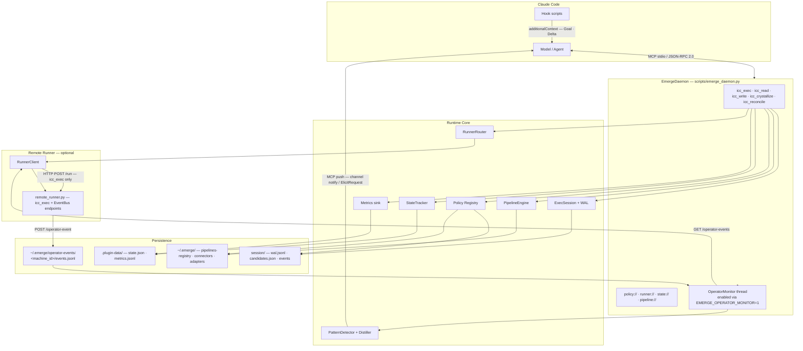

# Operator Intelligence Loop — Review Fixes Implementation Plan

> **For agentic workers:** REQUIRED SUB-SKILL: Use superpowers:subagent-driven-development (recommended) or superpowers:executing-plans to implement this plan task-by-task. Steps use checkbox (`- [ ]`) syntax for tracking.

**Goal:** Fix all issues found in the Operator Intelligence Loop code review: two critical security/correctness bugs, three important correctness issues, and several minor hardening items, without changing existing public interfaces.

**Architecture:** Keep each fix self-contained and testable in isolation. Security fixes (path traversal, stdout race) come first. Correctness fixes (monitor wiring, sliding window, schema) come second. Documentation/minor hardening last.

**Tech Stack:** Python 3.11+, `threading`, `collections.deque`, `pathlib`, `pytest`

---

## File Map

| File | What changes |
|---|---|
| `scripts/remote_runner.py` | Add `_validate_machine_id()` helper; call it in `write_operator_event` and `read_operator_events` |
| `scripts/distiller.py` | Add machine_id validation in `_write_confirmed_events`; add length cap in `_normalise` |
| `scripts/emerge_daemon.py` | Add module-level `_stdout_lock`; lock all stdout writes; call `start_operator_monitor()` + `atexit` in `run_stdio`; fix JSON Schema in `_build_elicit_params` |
| `scripts/operator_monitor.py` | Add per-machine sliding window event buffer (`collections.deque`) |
| `scripts/pattern_detector.py` | Add time windows to `_error_rate_check` and `_cross_machine_check`; fix `_frequency_check` signature collision |
| `scripts/observer_plugin.py` | Log warnings in `_load_from_file` instead of silent swallow |
| `scripts/observers/accessibility.py` | Check `result.returncode` before using stdout |
| `tests/test_remote_runner_events.py` | Add path traversal rejection tests |
| `tests/test_distiller.py` | Add length cap test |
| `tests/test_pattern_detector.py` | Add time-window tests for error_rate and cross_machine; add signature-no-collision test |
| `tests/test_operator_monitor.py` | Add cross-poll accumulation test |
| `tests/test_mcp_tools_integration.py` | Add run_stdio monitor wiring test; add elicit schema test |
| `skills/remote-runner-dev/SKILL.md` | Document `POST /operator-event` and `GET /operator-events` |
| `README.md` | Update Mermaid architecture diagram to include OperatorMonitor / EventBus / reverse flywheel |

---

## Task 1: machine_id path traversal — remote_runner.py (Critical #2)

**Files:**
- Modify: `scripts/remote_runner.py:50-80`
- Test: `tests/test_remote_runner_events.py`

- [ ] **Step 1: Write failing tests**

Add to `tests/test_remote_runner_events.py` after the existing tests:

```python
def test_post_event_rejects_path_traversal_machine_id(tmp_path):
    with _RunnerServer(tmp_path / "state") as server:
        body = json.dumps({
            "ts_ms": 1000,
            "machine_id": "../../../etc",
            "session_role": "operator",
            "event_type": "entity_added",
            "app": "zwcad",
            "payload": {},
        }).encode()
        req = urllib.request.Request(
            f"{server.url}/operator-event",
            data=body,
            headers={"Content-Type": "application/json"},
            method="POST",
        )
        try:
            urllib.request.urlopen(req, timeout=5)
            assert False, "should have raised"
        except urllib.error.HTTPError as e:
            assert e.code == 400


def test_get_events_rejects_path_traversal_machine_id(tmp_path):
    with _RunnerServer(tmp_path / "state") as server:
        url = f"{server.url}/operator-events?machine_id=../../../etc&since_ms=0"
        try:
            urllib.request.urlopen(url, timeout=5)
            assert False, "should have raised"
        except urllib.error.HTTPError as e:
            assert e.code == 400
```

- [ ] **Step 2: Run tests to confirm they fail**

```bash
python -m pytest tests/test_remote_runner_events.py::test_post_event_rejects_path_traversal_machine_id tests/test_remote_runner_events.py::test_get_events_rejects_path_traversal_machine_id -v
```

Expected: FAIL — server currently returns 200 / doesn't reject traversal paths.

- [ ] **Step 3: Add `_validate_machine_id` and call it**

In `scripts/remote_runner.py`, add this function just before `class RunnerExecutor`:

```python
def _validate_machine_id(machine_id: str) -> None:
    """Reject machine_id values that could escape the event root via path traversal."""
    if not machine_id:
        raise ValueError("machine_id is required")
    p = Path(machine_id)
    if p.name != machine_id or ".." in machine_id or "/" in machine_id or "\\" in machine_id:
        raise ValueError(f"Invalid machine_id: {machine_id!r}")
```

Replace `write_operator_event` (lines 50-59) with:

```python
def write_operator_event(self, event: dict) -> None:
    machine_id = str(event.get("machine_id", "")).strip()
    _validate_machine_id(machine_id)
    machine_dir = self._event_root / machine_id
    machine_dir.mkdir(parents=True, exist_ok=True)
    events_path = machine_dir / "events.jsonl"
    with self._event_write_lock:
        with events_path.open("a", encoding="utf-8") as f:
            f.write(json.dumps(event, ensure_ascii=False) + "\n")
```

Replace `read_operator_events` (lines 61-80) with:

```python
def read_operator_events(self, machine_id: str, since_ms: int = 0, limit: int = 200) -> list[dict]:
    _validate_machine_id(machine_id)
    machine_dir = self._event_root / machine_id
    if not machine_dir.exists():
        return []
    events_path = machine_dir / "events.jsonl"
    if not events_path.exists():
        return []
    results = []
    with events_path.open("r", encoding="utf-8") as f:
        for line in f:
            line = line.strip()
            if not line:
                continue
            try:
                e = json.loads(line)
            except json.JSONDecodeError:
                continue
            if e.get("ts_ms", 0) > since_ms:
                results.append(e)
    return results[-limit:]
```

- [ ] **Step 4: Run the new tests**

```bash
python -m pytest tests/test_remote_runner_events.py -v
```

Expected: All 6 tests PASS.

- [ ] **Step 5: Commit**

```bash
git add scripts/remote_runner.py tests/test_remote_runner_events.py
git commit -m "fix: reject path-traversal machine_id in runner event endpoints"
```

---

## Task 2: machine_id validation in distiller.py (Critical #2 — distiller path)

**Files:**
- Modify: `scripts/distiller.py`
- Test: `tests/test_distiller.py`

- [ ] **Step 1: Write failing test**

Add to `tests/test_distiller.py`:

```python
def test_distiller_rejects_path_traversal_machine_id(tmp_path):
    from scripts.distiller import Distiller
    from scripts.pattern_detector import PatternSummary
    d = Distiller(event_root=tmp_path / "events")
    summary = PatternSummary(
        machine_ids=["../../../etc"],
        intent_signature="zwcad.entity_added",
        occurrences=3,
        window_minutes=5.0,
        detector_signals=["frequency"],
        context_hint={"app": "zwcad"},
    )
    import pytest
    with pytest.raises(ValueError, match="Invalid machine_id"):
        d.distill(summary, confirmed=True)
```

- [ ] **Step 2: Run test to confirm it fails**

```bash
python -m pytest tests/test_distiller.py::test_distiller_rejects_path_traversal_machine_id -v
```

Expected: FAIL — no validation today.

- [ ] **Step 3: Add validation in distiller**

At the top of `scripts/distiller.py`, add the import and a local copy of the validator (to avoid circular imports):

```python
def _validate_machine_id(machine_id: str) -> None:
    from pathlib import Path as _Path
    p = _Path(machine_id)
    if p.name != machine_id or ".." in machine_id or "/" in machine_id or "\\" in machine_id:
        raise ValueError(f"Invalid machine_id: {machine_id!r}")
```

In `_write_confirmed_events`, add validation at the top of the for-loop:

```python
def _write_confirmed_events(self, summary: PatternSummary, sig: str) -> None:
    for machine_id in summary.machine_ids:
        _validate_machine_id(machine_id)
        machine_dir = self._event_root / machine_id
        machine_dir.mkdir(parents=True, exist_ok=True)
        event = {
            "ts_ms": int(time.time() * 1000),
            "machine_id": machine_id,
            "session_role": "monitor_sub",
            "event_type": "intent_confirmed",
            "payload": {
                "intent_signature": sig,
                "occurrences": summary.occurrences,
                "detector_signals": summary.detector_signals,
                "context_hint": summary.context_hint,
            },
        }
        events_path = machine_dir / "events.jsonl"
        with events_path.open("a", encoding="utf-8") as f:
            f.write(json.dumps(event, ensure_ascii=False) + "\n")
```

Also add a length cap at the end of `_normalise`:

```python
    result = ".".join(clean) if clean else "unknown.pattern"
    return result[:200]
```

- [ ] **Step 4: Write length cap test and run all distiller tests**

Add to `tests/test_distiller.py`:

```python
def test_normalise_caps_length():
    from scripts.distiller import Distiller
    long_sig = "a" * 100 + "." + "b" * 100 + "." + "c" * 100
    result = Distiller._normalise(long_sig)
    assert len(result) <= 200
```

```bash
python -m pytest tests/test_distiller.py -v
```

Expected: All tests PASS.

- [ ] **Step 5: Commit**

```bash
git add scripts/distiller.py tests/test_distiller.py
git commit -m "fix: validate machine_id in Distiller; cap intent_signature length at 200"
```

---

## Task 3: stdout lock + run_stdio wiring (Critical #1 + Important #3)

**Files:**
- Modify: `scripts/emerge_daemon.py:1579-1617`
- Test: `tests/test_mcp_tools_integration.py`

- [ ] **Step 1: Write failing test for run_stdio wiring**

Add to `tests/test_mcp_tools_integration.py`:

```python
def test_run_stdio_starts_operator_monitor_when_env_set(monkeypatch, tmp_path):
    """run_stdio must call start_operator_monitor() so the env var actually works."""
    import io, threading
    from scripts.emerge_daemon import EmergeDaemon

    started = []
    original_start = EmergeDaemon.start_operator_monitor

    def fake_start(self):
        started.append(True)
        # Do NOT actually start the thread — keep test fast
    monkeypatch.setattr(EmergeDaemon, "start_operator_monitor", fake_start)
    monkeypatch.setenv("EMERGE_OPERATOR_MONITOR", "1")
    monkeypatch.setenv("EMERGE_STATE_ROOT", str(tmp_path))

    # Provide one valid JSON-RPC line then EOF
    import scripts.emerge_daemon as _mod
    _orig_stdin = sys.stdin
    sys.stdin = io.StringIO('{"jsonrpc":"2.0","id":1,"method":"ping","params":{}}\n')
    try:
        _mod.run_stdio()
    except Exception:
        pass
    finally:
        sys.stdin = _orig_stdin

    assert started, "run_stdio did not call start_operator_monitor()"
```

- [ ] **Step 2: Run test to confirm it fails**

```bash
python -m pytest "tests/test_mcp_tools_integration.py::test_run_stdio_starts_operator_monitor_when_env_set" -v
```

Expected: FAIL — `started` is empty.

- [ ] **Step 3: Add module-level stdout lock and protect all stdout writes**

At the top of `scripts/emerge_daemon.py`, after the existing imports, add:

```python
_stdout_lock = threading.Lock()
```

Replace `_write_mcp_push` (lines ~1579-1582):

```python
def _write_mcp_push(self, payload: dict) -> None:
    """Write a JSON-RPC notification/request to stdout for CC to receive."""
    line = json.dumps(payload) + "\n"
    with _stdout_lock:
        sys.stdout.write(line)
        sys.stdout.flush()
```

Replace the two stdout write blocks inside `run_stdio` (the parse-error path and the normal response path):

```python
def run_stdio() -> None:
    import atexit
    daemon = EmergeDaemon()
    daemon.start_operator_monitor()
    atexit.register(daemon.stop_operator_monitor)
    for line in sys.stdin:
        text = line.strip()
        if not text:
            continue
        try:
            req = json.loads(text)
        except json.JSONDecodeError as exc:  # pragma: no cover
            resp = {
                "jsonrpc": "2.0",
                "id": None,
                "error": {"code": -32700, "message": f"Parse error: {exc}"},
            }
            if resp is not None:
                with _stdout_lock:
                    sys.stdout.write(json.dumps(resp) + "\n")
                    sys.stdout.flush()
            continue
        try:
            resp = daemon.handle_jsonrpc(req)
        except Exception as exc:  # pragma: no cover
            resp = {
                "jsonrpc": "2.0",
                "id": None,
                "error": {"code": -32603, "message": str(exc)},
            }
        if resp is not None:
            with _stdout_lock:
                sys.stdout.write(json.dumps(resp) + "\n")
                sys.stdout.flush()
```

- [ ] **Step 4: Run the wiring test and full suite**

```bash
python -m pytest "tests/test_mcp_tools_integration.py::test_run_stdio_starts_operator_monitor_when_env_set" -v
python -m pytest tests -q
```

Expected: New test PASS. Full suite PASS.

- [ ] **Step 5: Commit**

```bash
git add scripts/emerge_daemon.py tests/test_mcp_tools_integration.py
git commit -m "fix: wire OperatorMonitor into run_stdio; lock stdout for thread safety"
```

---

## Task 4: sliding window event buffer in OperatorMonitor (Important #4)

**Files:**
- Modify: `scripts/operator_monitor.py`
- Test: `tests/test_operator_monitor.py`

- [ ] **Step 1: Write failing test**

Add to `tests/test_operator_monitor.py`:

```python
def test_operator_monitor_accumulates_events_across_polls(tmp_path):
    """Events arriving one-per-poll across multiple polls must still trigger detection.
    This validates the sliding window buffer — a single batch never has >=3 events,
    but the 20-minute window accumulation should fire."""
    push_calls = []

    now_ms = int(time.time() * 1000)
    # 3 events spread across time, each returned one at a time by the fake client
    all_events = [
        {
            "ts_ms": now_ms - i * 60_000,
            "machine_id": "m1",
            "session_role": "operator",
            "event_type": "entity_added",
            "app": "zwcad",
            "payload": {"layer": "标注", "content": f"room_{i}"},
        }
        for i in range(3)
    ]

    call_count = [0]

    class _OnePollClient:
        """Returns exactly one event per call, simulating events arriving one per poll."""
        def get_events(self, machine_id: str, since_ms: int = 0) -> list[dict]:
            idx = call_count[0]
            call_count[0] += 1
            matching = [e for e in all_events if e["ts_ms"] > since_ms]
            return matching[idx:idx+1]  # one at a time

    monitor = OperatorMonitor(
        machines={"m1": _OnePollClient()},
        push_fn=lambda s, c, x: push_calls.append(1),
        poll_interval_s=0.05,
        event_root=tmp_path / "events",
        adapter_root=tmp_path / "adapters",
    )
    monitor.start()
    time.sleep(0.5)
    monitor.stop()

    assert len(push_calls) >= 1, "pattern should have fired after accumulating 3 events"
```

- [ ] **Step 2: Run test to confirm it fails**

```bash
python -m pytest tests/test_operator_monitor.py::test_operator_monitor_accumulates_events_across_polls -v
```

Expected: FAIL — no pattern fires because no single batch has 3 events.

- [ ] **Step 3: Add sliding window buffer to OperatorMonitor**

Replace `scripts/operator_monitor.py` in full:

```python
from __future__ import annotations

import time
import threading
from collections import deque
from pathlib import Path
from typing import Any, Callable

from scripts.observer_plugin import AdapterRegistry
from scripts.pattern_detector import PatternDetector, PatternSummary


class _RunnerClientProtocol:
    """Duck-typed protocol for runner clients used by OperatorMonitor."""
    def get_events(self, machine_id: str, since_ms: int = 0) -> list[dict]: ...


class OperatorMonitor(threading.Thread):
    """Background thread that polls remote runners for operator events,
    runs PatternDetector against a per-machine sliding window buffer,
    and calls push_fn when a pattern is found."""

    def __init__(
        self,
        machines: dict[str, Any],
        push_fn: Callable[[str, dict, PatternSummary], None],
        poll_interval_s: float = 5.0,
        event_root: Path | None = None,
        adapter_root: Path | None = None,
    ) -> None:
        super().__init__(daemon=True, name="OperatorMonitor")
        self._machines = machines
        self._push_fn = push_fn
        self._poll_interval_s = poll_interval_s
        self._event_root = event_root or (Path.home() / ".emerge" / "operator-events")
        self._adapter_registry = AdapterRegistry(adapter_root=adapter_root)
        self._detector = PatternDetector()
        self._last_poll_ms: dict[str, int] = {}
        # Sliding window buffer: accumulates events within FREQ_WINDOW_MS per machine.
        self._event_buffers: dict[str, deque] = {}
        self._stop_event = threading.Event()

    def stop(self) -> None:
        self._stop_event.set()

    def run(self) -> None:
        while not self._stop_event.wait(timeout=self._poll_interval_s):
            for machine_id, client in self._machines.items():
                try:
                    self._poll_machine(machine_id, client)
                except Exception:
                    pass

    def _poll_machine(self, machine_id: str, client: Any) -> None:
        since_ms = self._last_poll_ms.get(machine_id, 0)
        events = client.get_events(machine_id=machine_id, since_ms=since_ms)

        # Advance the high-water mark even if events is empty (no re-fetch on next poll)
        if events:
            latest_ts = max(e.get("ts_ms", 0) for e in events)
            self._last_poll_ms[machine_id] = latest_ts

            # Accumulate into sliding window buffer
            buf = self._event_buffers.setdefault(machine_id, deque())
            buf.extend(events)

        buf = self._event_buffers.get(machine_id)
        if not buf:
            return

        # Trim events older than the detector's frequency window
        now_ms = int(time.time() * 1000)
        window_ms = PatternDetector.FREQ_WINDOW_MS
        while buf and now_ms - buf[0].get("ts_ms", 0) > window_ms:
            buf.popleft()

        if not buf:
            return

        summaries = self._detector.ingest(list(buf))
        for summary in summaries:
            app = summary.context_hint.get("app", machine_id)
            plugin = self._adapter_registry.get_plugin(app)
            try:
                context = plugin.get_context(summary.context_hint)
            except Exception:
                context = summary.context_hint.copy()
            self._push_fn(summary.policy_stage, context, summary)
```

- [ ] **Step 4: Run all operator monitor tests**

```bash
python -m pytest tests/test_operator_monitor.py -v
```

Expected: All 4 tests PASS.

- [ ] **Step 5: Commit**

```bash
git add scripts/operator_monitor.py tests/test_operator_monitor.py
git commit -m "fix: accumulate events in sliding window buffer so cross-poll patterns fire"
```

---

## Task 5: fix JSON Schema in _build_elicit_params (Important #5)

**Files:**
- Modify: `scripts/emerge_daemon.py:1565-1577`
- Test: `tests/test_mcp_tools_integration.py`

- [ ] **Step 1: Write failing test**

Add to `tests/test_mcp_tools_integration.py`:

```python
def test_build_elicit_params_schema_is_valid_json_schema(tmp_path):
    """requestedSchema must be a valid JSON Schema object with type+properties."""
    import os
    os.environ["EMERGE_STATE_ROOT"] = str(tmp_path)
    try:
        from scripts.emerge_daemon import EmergeDaemon
        from scripts.pattern_detector import PatternSummary
        daemon = EmergeDaemon(root=tmp_path)
        summary = PatternSummary(
            machine_ids=["m1"],
            intent_signature="zwcad.entity_added",
            occurrences=5,
            window_minutes=10.0,
            detector_signals=["frequency"],
            context_hint={"app": "zwcad"},
            policy_stage="canary",
        )
        params = daemon._build_elicit_params("canary", {"app": "zwcad"}, summary)
        schema = params["requestedSchema"]
        assert schema.get("type") == "object", "schema must have type=object"
        assert "properties" in schema, "schema must have properties key"
        assert "action" in schema["properties"]
        assert "note" in schema["properties"]
    finally:
        os.environ.pop("EMERGE_STATE_ROOT", None)
```

- [ ] **Step 2: Run test to confirm it fails**

```bash
python -m pytest "tests/test_mcp_tools_integration.py::test_build_elicit_params_schema_is_valid_json_schema" -v
```

Expected: FAIL — schema has no `type` or `properties` key.

- [ ] **Step 3: Fix `_build_elicit_params` schema structure**

Replace lines 1565-1577 in `scripts/emerge_daemon.py`:

```python
        properties: dict = {
            "action": {
                "type": "string",
                "oneOf": [
                    {"const": "yes", "title": "是，接管"},
                    {"const": "later", "title": "稍后"},
                    {"const": "no", "title": "不需要"},
                ],
            }
        }
        if stage == "canary":
            properties["note"] = {"type": "string", "description": "补充说明（可选）", "maxLength": 200}
        schema = {
            "type": "object",
            "properties": properties,
            "required": ["action"],
        }
        return {"mode": "form", "message": message, "requestedSchema": schema}
```

- [ ] **Step 4: Run the test**

```bash
python -m pytest "tests/test_mcp_tools_integration.py::test_build_elicit_params_schema_is_valid_json_schema" -v
```

Expected: PASS.

- [ ] **Step 5: Commit**

```bash
git add scripts/emerge_daemon.py tests/test_mcp_tools_integration.py
git commit -m "fix: wrap elicitation requestedSchema in type=object/properties per JSON Schema spec"
```

---

## Task 6: fix _frequency_check signature collision in PatternDetector (Minor)

**Files:**
- Modify: `scripts/pattern_detector.py:67`
- Test: `tests/test_pattern_detector.py`

- [ ] **Step 1: Write failing test**

Add to `tests/test_pattern_detector.py`:

```python
def test_frequency_check_no_signature_collision_across_event_types():
    """Different event_types on the same layer must produce different intent_signatures."""
    import time
    now_ms = int(time.time() * 1000)
    detector = PatternDetector()

    def make_events(event_type: str) -> list[dict]:
        return [
            {
                "ts_ms": now_ms - i * 60_000,
                "machine_id": "m1",
                "session_role": "operator",
                "event_type": event_type,
                "app": "zwcad",
                "payload": {"layer": "标注", "content": f"x_{i}"},
            }
            for i in range(3)
        ]

    summaries = detector.ingest(make_events("entity_added") + make_events("entity_modified"))
    sigs = [s.intent_signature for s in summaries]
    assert len(set(sigs)) == len(sigs), f"Duplicate signatures found: {sigs}"
    assert any("entity_added" in s for s in sigs)
    assert any("entity_modified" in s for s in sigs)
```

- [ ] **Step 2: Run test to confirm it fails**

```bash
python -m pytest "tests/test_pattern_detector.py::test_frequency_check_no_signature_collision_across_event_types" -v
```

Expected: FAIL — both event types produce the same signature when `layer` is non-empty.

- [ ] **Step 3: Fix signature generation in `_frequency_check`**

Replace line 67 in `scripts/pattern_detector.py`:

```python
            sig = f"{app}.{event_type}" + (f".{layer.replace('/', '_')}" if layer else "")
```

- [ ] **Step 4: Run all pattern detector tests**

```bash
python -m pytest tests/test_pattern_detector.py -v
```

Expected: All tests PASS.

- [ ] **Step 5: Commit**

```bash
git add scripts/pattern_detector.py tests/test_pattern_detector.py
git commit -m "fix: include event_type in frequency detector signature to prevent layer collisions"
```

---

## Task 7: add time windows to _error_rate_check and _cross_machine_check (Minor)

**Files:**
- Modify: `scripts/pattern_detector.py:83-136`
- Test: `tests/test_pattern_detector.py`

- [ ] **Step 1: Write failing tests**

Add to `tests/test_pattern_detector.py`:

```python
def test_error_rate_check_ignores_old_undos():
    """Undo events older than FREQ_WINDOW_MS must not inflate the error rate."""
    import time
    now_ms = int(time.time() * 1000)
    old_ms = now_ms - PatternDetector.FREQ_WINDOW_MS - 60_000  # well outside window
    detector = PatternDetector()

    events = [
        # 5 old undo events (outside window) — should not count
        {"ts_ms": old_ms - i * 1000, "machine_id": "m1", "session_role": "operator",
         "event_type": "undo", "app": "zwcad", "session_id": "s1", "payload": {}}
        for i in range(5)
    ] + [
        # 1 recent non-undo event (inside window) — ratio should be 0/1 = 0.0
        {"ts_ms": now_ms, "machine_id": "m1", "session_role": "operator",
         "event_type": "entity_added", "app": "zwcad", "session_id": "s1", "payload": {}}
    ]
    summaries = detector.ingest(events)
    assert not any(s for s in summaries if "error_rate" in s.detector_signals), \
        "old undos outside window should not trigger error_rate"


def test_cross_machine_check_ignores_old_events():
    """Events older than FREQ_WINDOW_MS must not contribute to cross-machine detection."""
    import time
    now_ms = int(time.time() * 1000)
    old_ms = now_ms - PatternDetector.FREQ_WINDOW_MS - 60_000
    detector = PatternDetector()

    events = [
        # 2 old events on machine A — outside window
        {"ts_ms": old_ms - i * 1000, "machine_id": "mA", "session_role": "operator",
         "event_type": "entity_added", "app": "zwcad", "session_id": "s1", "payload": {}}
        for i in range(2)
    ] + [
        # 2 old events on machine B — outside window
        {"ts_ms": old_ms - i * 1000, "machine_id": "mB", "session_role": "operator",
         "event_type": "entity_added", "app": "zwcad", "session_id": "s2", "payload": {}}
        for i in range(2)
    ]
    summaries = detector.ingest(events)
    assert not any(s for s in summaries if "cross_machine" in s.detector_signals), \
        "old cross-machine events outside window should not trigger detection"
```

- [ ] **Step 2: Run tests to confirm they fail**

```bash
python -m pytest "tests/test_pattern_detector.py::test_error_rate_check_ignores_old_undos" "tests/test_pattern_detector.py::test_cross_machine_check_ignores_old_events" -v
```

Expected: FAIL.

- [ ] **Step 3: Add time windows to both checks**

In `scripts/pattern_detector.py`, replace `_error_rate_check` and `_cross_machine_check`:

```python
    def _error_rate_check(self, events: list[dict]) -> list[PatternSummary]:
        now_ms = int(time.time() * 1000)
        window_events = [e for e in events if now_ms - e.get("ts_ms", 0) <= self.FREQ_WINDOW_MS]
        by_session: dict[str, list[dict]] = {}
        for e in window_events:
            sid = e.get("session_id", "unknown")
            by_session.setdefault(sid, []).append(e)

        summaries = []
        for sid, grp in by_session.items():
            total_ops = len([e for e in grp if e.get("event_type") != "undo"])
            undos = len([e for e in grp if e.get("event_type") == "undo"])
            if total_ops == 0:
                continue
            ratio = undos / total_ops
            if ratio < self.ERROR_RATE_THRESHOLD:
                continue
            machines = list({e.get("machine_id", "unknown") for e in grp})
            app = grp[0].get("app", "unknown") if grp else "unknown"
            summaries.append(PatternSummary(
                machine_ids=machines,
                intent_signature=f"{app}.high_error_rate",
                occurrences=len(grp),
                window_minutes=self.FREQ_WINDOW_MS / 60_000,
                detector_signals=["error_rate"],
                context_hint={"app": app, "undo_ratio": ratio, "session_id": sid},
            ))
        return summaries

    def _cross_machine_check(self, events: list[dict]) -> list[PatternSummary]:
        now_ms = int(time.time() * 1000)
        window_events = [e for e in events if now_ms - e.get("ts_ms", 0) <= self.FREQ_WINDOW_MS]
        by_app_event: dict[tuple, dict[str, list[dict]]] = {}
        for e in window_events:
            key = (e.get("app", ""), e.get("event_type", ""))
            machine = e.get("machine_id", "unknown")
            by_app_event.setdefault(key, {}).setdefault(machine, []).append(e)

        summaries = []
        for (app, event_type), by_machine in by_app_event.items():
            qualifying = {
                m: evts
                for m, evts in by_machine.items()
                if len(evts) >= self.CROSS_MACHINE_MIN_PER_MACHINE
            }
            if len(qualifying) < self.CROSS_MACHINE_MIN_MACHINES:
                continue
            all_events = [e for evts in qualifying.values() for e in evts]
            machines = list(qualifying.keys())
            summaries.append(PatternSummary(
                machine_ids=machines,
                intent_signature=f"{app}.{event_type}.cross_machine",
                occurrences=len(all_events),
                window_minutes=self.FREQ_WINDOW_MS / 60_000,
                detector_signals=["cross_machine"],
                context_hint={"app": app, "event_type": event_type, "machines": machines},
            ))
        return summaries
```

- [ ] **Step 4: Run all pattern detector tests**

```bash
python -m pytest tests/test_pattern_detector.py -v
```

Expected: All tests PASS.

- [ ] **Step 5: Commit**

```bash
git add scripts/pattern_detector.py tests/test_pattern_detector.py
git commit -m "fix: apply FREQ_WINDOW_MS time window to error_rate and cross_machine detectors"
```

---

## Task 8: harden _load_from_file logging + accessibility returncode check (Minor)

**Files:**
- Modify: `scripts/observer_plugin.py:91-112`
- Modify: `scripts/observers/accessibility.py:16-28`

- [ ] **Step 1: Add logging to _load_from_file**

At the top of `scripts/observer_plugin.py`, add after existing imports:

```python
import logging
_log = logging.getLogger(__name__)
```

Replace the `except Exception: return None` block in `_load_from_file`:

```python
        except Exception as exc:
            _log.warning("AdapterRegistry: failed to load adapter %r from %s: %s", name, path, exc)
            return None
```

- [ ] **Step 2: Check returncode in AccessibilityObserver**

Replace `get_context` in `scripts/observers/accessibility.py`:

```python
    def get_context(self, hint: dict) -> dict:
        import subprocess, sys as _sys
        ctx: dict = {"observer": "accessibility", "hint": hint}
        try:
            if _sys.platform == "darwin":
                result = subprocess.run(
                    ["osascript", "-e",
                     'tell application "System Events" to get name of first process whose frontmost is true'],
                    capture_output=True, text=True, timeout=2,
                )
                if result.returncode == 0:
                    ctx["focused_app"] = result.stdout.strip()
        except Exception:
            pass
        return ctx
```

- [ ] **Step 3: Run full test suite to verify no regressions**

```bash
python -m pytest tests -q
```

Expected: All tests PASS.

- [ ] **Step 4: Commit**

```bash
git add scripts/observer_plugin.py scripts/observers/accessibility.py
git commit -m "fix: log adapter load failures; check osascript returncode before using stdout"
```

---

## Task 9: update remote-runner-dev/SKILL.md (Important #6)

**Files:**
- Modify: `skills/remote-runner-dev/SKILL.md`

- [ ] **Step 1: Add EventBus endpoints to Ops Endpoints section**

In `skills/remote-runner-dev/SKILL.md`, find the `## Ops Endpoints` section (currently ends after the `/run` entry) and replace it with:

```markdown
## Ops Endpoints

```bash
GET  /health        # {"ok": true, "status": "ready", "uptime_s": N}
GET  /status        # pid, python, root, uptime_s
GET  /logs?n=100    # last N lines of .runner.log
POST /run           # {"tool_name": "icc_exec", "arguments": {...}}
POST /operator-event                         # append one event to local EventBus
GET  /operator-events?machine_id=&since_ms=&limit=   # read events since ts
```

The runner accepts **only `icc_exec`** requests on `/run`. Pipeline operations (`icc_read`, `icc_write`) are handled by the daemon: it loads pipeline `.py` + `.yaml` locally, builds self-contained inline code, and sends it as `icc_exec`. Connector files never need to exist on the runner machine.

### EventBus endpoints

`POST /operator-event` — append a single operator event to the local EventBus file.

Request body (JSON):
```json
{
  "ts_ms": 1712345678000,
  "machine_id": "workstation-01",
  "session_role": "operator",
  "event_type": "entity_added",
  "app": "zwcad",
  "payload": {"layer": "标注", "content": "主卧"}
}
```
`machine_id` must be a plain identifier — no path separators or `..` components.

Response: `{"ok": true}` or `{"ok": false, "error": "..."}` with HTTP 400.

---

`GET /operator-events?machine_id=<id>&since_ms=<ts>&limit=<n>` — read events newer than `since_ms` (default 0), up to `limit` (default 200, max 1000).

Response: `{"ok": true, "events": [...]}`.

These two endpoints are consumed by `OperatorMonitor` in the daemon when `EMERGE_OPERATOR_MONITOR=1`.
```

- [ ] **Step 2: Verify the file looks correct, then commit**

```bash
python -m pytest tests -q  # sanity check — doc change, no code change
git add skills/remote-runner-dev/SKILL.md
git commit -m "docs: add /operator-event and /operator-events to remote-runner-dev skill"
```

---

## Task 10: update README architecture diagram (Important #7)

**Files:**
- Modify: `README.md` (Mermaid `flowchart TB` block, lines ~21-63)

- [ ] **Step 1: Replace the Mermaid diagram**

Find the `flowchart TB` block in `README.md` and replace it with:



- [ ] **Step 2: Verify and commit**

```bash
python -m pytest tests -q
git add README.md
git commit -m "docs: update architecture diagram to include OperatorMonitor, EventBus, and reverse flywheel"
```

---

## Final Verification

- [ ] **Run the complete test suite**

```bash
python -m pytest tests -q
```

Expected: All tests PASS. Count should be ≥ 157 (new tests added in tasks 1–7 will increase it).

- [ ] **Update test count badge in README.md if count changed**

```bash
python -m pytest tests -q 2>&1 | tail -3
# Update the badge line in README.md: 
git add README.md
git commit -m "docs: update test count badge"
```
